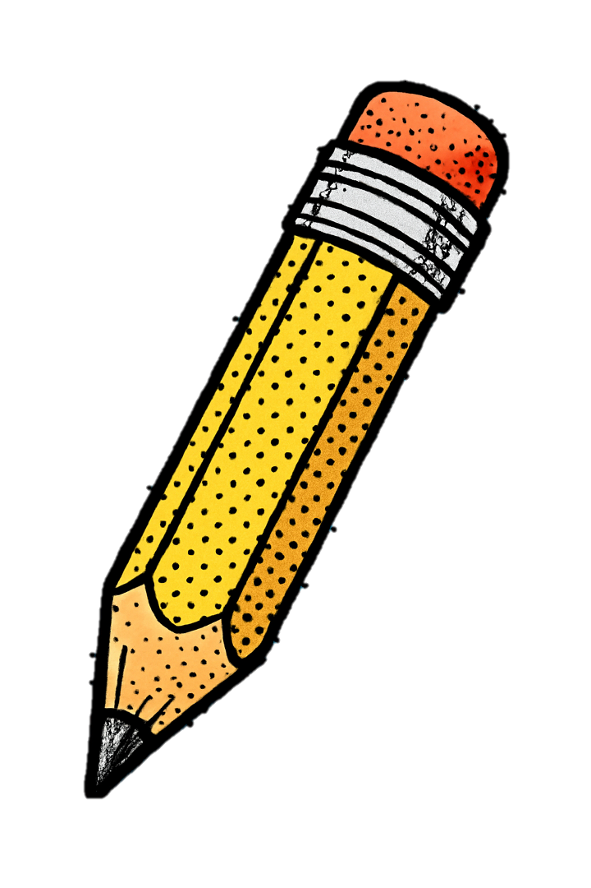
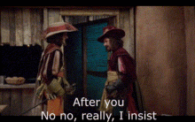

# Introduction to Advanced Bioinformatics

2025-05-05

## Table of Contents
[Welcome](#welcome) 
[Prerequisites](#prerequisites) 
[Course Navigation](#course-navigation) 
[Icebreaker](#icebreaker) 
[*Advanced*](#advanced) 
[Moodle](#moodle) 
[Research Question](#research-question) 
[Recap](#recapd) 

## Welcome

Welcome to Advanced Bioinformatics (BCHM5420) at the University of Lethbridge! In this course we will explore key principles such as workflow management, version control, and results interpretation while guiding you through the process of developing a research question, analyzing data, and communicating your findings. 

## Prerequisites 
- Biochemistry 5400/ Neuroscience 5400

## Course Navigation

- Course content will be hosted on GitHub as Jupyter notebooks at [uleth-advanced-bioinformatics/BCHM5420A-summer-2025](https://github.com/uleth-advanced-bioinformatics/BCHM5420A-summer-2025). 
- Grading, assignment submissions, syllabus, and rubrics are available on [Moodle](https://moodle.uleth.ca/course/view.php?id=22013). You will also find links to the corresponding Jupyter notebook for each class in Moodle.
- Class will be held on MS Teams on Mondays and Wednesdays, 6:00pm - 8:45pm MT, starting May 5th and ending June 16. 
- You should be automatically added to our BCHM5420 MS Teams Class group. We encourage you to connect with your classmates and post things of interest in our class channel there!
- Office hours are available for scheduling between 6:00pm-8:00pm MT on Thursdays. Note: Office hours must be scheduled in advance, requested by the end of class the Wednesday prior.
- The course is structured to guide you through the development, management, and presentation of your own bioinformatic project. While you will not be expected to develop a Nextflow pipeline from scratch or publish your findings in Nature, you will be expected to use bioinformatic tools to generate results, analyze them reproducibly, and present them effectively. The focus is to develop skills that will allow you to meaningfully bring your understanding of biochemistry and programming together.  

### Class Legend

Throughout the Jupyter notebooks you will notice icons which indicate the types of activities in the table below. You may read about swimming, but the best way to learn to swim is to jump in and practice! We highly encourage you to follow along during dry lab activities and hope you will feel comfortable asking questions.

|Icon| Meaning |
|:-----|:------|
| | Interactive dry   lab activity |
| | Tips & tricks|
| | Discussion|
| | Assignment |

## Icebreaker 

### Introductions

Please tell us a bit about yourself! 
- Your name
- How you got into bioinformatics/ what interests you most about it?
- What do you hope to get out of this course/ what's the main thing you want to learn?
- What does your typical Sunday look like? What are your hobbies? 
- What is your dream/ goal?
- Describe the plot of your favourite movie, and see if we can identify it.
- What is your hottest take? 

### Bioinformatic Pictionary

Join the pictionary room where someone randomly selected will draw molecular biology & bioinformatic concepts while the rest of the class deciphers.

### Ribosomes 

We have likely all encountered the awkwardness of online video communication, when multiple people go to speak at the same time..

Let's get it out of our systems with a game of "ribosomes". One objective: collectively read out the complete sequence. 

There are 3 simple rules:

1. You cannot discuss who will start or go next
2. Everyone must say at least 1 letter
3. If multiple people say a base at the same time, you must start from the beginning

Good luck! 

## *Advanced*

This course builds from the essentials in bioinformatics by walking through the computational and biological complexities of real-world research. You will begin shifting from the mindest of **user to developer**, using your skills in Python programming, familiarity with CLI, virtual environments, (and more!) to critically problem solve. Key advancements:

- **Data Complexity**: Real-world data are noisy, incomplete, or large, high-throughput datasets such as metagenomic reads, ribosomal repeats, and variant-rich populations. Often, things do not go according to plan! These require more sophisticated preprocessing, troubleshooting QC, and interpretation than clean, model test data.

- **Algorithmic Insight**: Instead of treating tools as black boxes, it may be necessary to examine the principles behind them for the purpose of your research question (ex. which parameters should you use for your case and why).

- **Custom Pipelines & Reproducibility**: You will use modular, scalable workflows with tools like `Nextflow` integrating command-line utilities (ex. fastp, BLAST, BWA-mem, etc.), scripting, and Git version control for reproducible science. We will look at tools that facilitate reproducible workflows.

- **Advanced Tooling & Programming**: We will build on command-line proficiency, scripting in Python/R, and working with various bioinformatics libraries (ex. `Biopython`, `pysam`, `scikit-bio`, `pwr`, `phangorn`) which will be required to analyze and visualize pipeline outputs to draw actionable conclusions from them. 

- **Biological Interpretation of Complex Patterns**: Beyond computing results, we emphasize critical thinking: do these results make sense? How do they relate to evolutionary pressures, antimicrobial resistance, or structural variation? What are the limitations of your inference?

In advanced bioinformatics, you are expected to operate like a researcher, using your existing toolkits to:
- Ask the right questions
- Manage a project yourself from start to finish 
- Use or adjust tools to fit your purpose (ex. Nextflow)
- Interpret and communicate complex biological data (ex. final presentations)
- Ensure reproducibility and robustness (ex. version control & final demo)

## Moodle

Let's head over to [Moodle](https://moodle.uleth.ca/course/view.php?id=22013) to go over the course syllabus and rubrics!

## Research Question 

We are at the end of class and the start of your bioinformatics project. What topics interest you in biochemistry, neuroscience, biology, medicine, microbiology, etc.? Think about bioinformatic analyses you have previously seen and portions you could recapitulate or modify. The first assignment will be to complete an initial research proposal for submission on 2025-05-14 (see Moodle for more details). Keep in mind that this project presents a great addition to your portfolio!

## Recap

We hope you feel more ***oriented*** in ***Advanced*** Bioinformatics BCHM5420/NEUR5420 and comfortable to actively engage in learning. You have been introduced to course resources on ***Moodle*** (syllabus and assignments), ***MS Teams*** (class and discussion forum), and ***GitHub*** (content). You have started to think about your bioinformatic project.
