# Introduction to Nextflow
2025-05-12


## Table of Contents

[Workflow Management](#workflow-management)<br>
[What is Nextflow](#what-is-nextflow)<br>
[When to Use Nextflow](#when-to-use-nexflow)<br>
[Running Nextflow Pipelines](#running-nextflow-pipelines)<br>
[Parameters](#parameters)<br>
[Parts of a Nextflow Pipeline](#parts-of-a-nextflow-pipeline)<br>
[1. Workflow](#1-workflow)<br>
[2. Channel](#2-channel)<br>
[3. Process](#3-process)<br>
[Docker in Nextflow](#docker-in-nextflow)<br>
[nf-core](#nf-core) <br>
[Recap](#recap)<br>


## Workflow Management

The sequence of tasks required to analyze data is referred to as a ***workflow*** or "bioinformatic pipeline". We make scripts to do these tasks for us, and may have other scripts to process the outputs of other scripts. For example, let's take our fastq sequences, we need to run an analysis to do quality control (QC) on the data to make sure it is fit for downstream analysis. Then we need to use another tool to assemble our reads into a consensus fasta, and yet another tool to determine the variation in the sample relative to a reference genome, and maybe another to generate a tree to see where this sample clusters relative to other samples and determine a lineage. And oh look at that we have 100 samples, and now we have to run all these steps over again for all the samples. Back in the day, we stitched together these tasks with a general purpose programming language like Python or Bash or waaay back in the day, Perl. 

All of this sounds like a lot of work to run manually right? Well, thank goodness Sequera has made Nextflow! Nextflow is a domain specific language, with that domain being workflow management. Now all we have to do is tell Nextflow what your input file is, it will do all the work for us, on all our samples and we get all our results in one fancy output directory. 

In this course, we do not expect you to know all the inner workings of Nextflow or to build your own pipeline, but we will be introducing you to some of the high level details and will be focusing on the application of existing Nextflow pipelines. 

### Pipelines
 

A pipeline in Nextflow is a set of connected ***processes*** that define how data flows from one step to another. Each process performs a specific ***task*** (like trimming reads, aligning sequences, or generating a report), and data is passed between them using ***channels***. Nextflow makes it easy to parallelize tasks (for example, running the same script or tool on multiple samples at once), manage resources, and run workflows on your local machine, HPC, or the cloud.

For example, a basic bioinformatics pipeline might look like this:

- Download data – fetch input FASTQ files.

- Trim reads – remove adapters or low-quality bases.

- Align reads – map them to a reference genome.

- Call variants – identify mutations or SNPs.

- Generate report – summarize results.


### All is FAIR in Love and Workflow Management

Workflow management systems like Nextflow, snakemake, or WDL make analyzing data more FAIR. 

- **Findable:** Pipelines consistently produce metadata and data in standardized formats (ex. file naming patterns, \*.fasta, \*.bam), making it easier for others to search. 

- **Accessible:** Pipelines can automate data retrieval (ex. a process that uses NCBI's Entrez) or publication, making it more accessible than a list of intructions telling a user how to manually retrieve a dataset or a script that is run in a different computing environment.

- **Interoperable:** The same Nextflow pipeline can be run across different computing infrastructures like your laptop or an HPC cluster ("server"). Interoperability of Nextflow is partially attributable to how well it integrates dependency management systems like docker or conda, allowing for the same software to work across different computers.   

- **Reusable:** You can perform the same analysis of data repeatedly using a Nextflow pipeline. 

<br>
 
Consistency is key!

## What is Nextflow? 

Nextflow is a workflow management system and language specific to the domain (DSL) of writing computational workflows. For example, SQL is used for working with databases, so it is also a DSL. The Nextflow scripting language is based on Groovy programming language, which is based on Java. Namely, Nextflow:

- manages how software is executed on the OS 
- manages how tasks + data are split and run simultaneously (parallelization)
- manages the software required for different tasks (Docker, conda, singularity)
- manages interruptions to workflow through resumability 

## When to Use Nexflow

"it is tempting, if the only tool you have is a hammer, to treat everything as if it were a nail." - Abraham Maslow

Not every bioinformatic analysis will require Nextflow, but here are some tell-tale signs that it might!

- you have loads of parallel tasks, like running the same script across 1000 input samples, where the only thing changing is which sample.
- you want to run the same analysis in different computing platforms like your laptop and later that week an HPC cluster - Nextflow is designed to be portable.
- you have several steps in your bioinformatic analysis, that either need to be performed sequentially or can be executed in parallel. ie. you find yourself struggling to keep track of those \*.vcf files for downstream consensus sequence building or variant annotation. Nextflow uses a dataflow model as opposed to being linear. The dataflow model means tasks run as soon as the necessary input is received, instead of letting the data idle until the task using it is scheduled to run.
- you have access to a workload manager like SLURM or Sungrid engine (or HPC) - Nextflow excels at integrating with workload managers and handling job distribution across available computational resources. 
- you want to be able to easily add or takeaway scripts in the future - Nextflow is [modular](https://training.nextflow.io/latest/basic_training/modules/)!
- you want to be able to pick up analysis where you left off - pipeline execution is tracked, so you can start from the most recent successfully executed step.


## Running Nextflow Pipelines


Let's start with creating a simple nextflow script (tutorial taken from [here](https://training.nextflow.io/2.1.1/hello_nextflow/01_hello_world/#11-examine-the-overall-code-structure)). 
Activate your virtual environment that contains Nextflow and its software dependencies.


```python
touch hello-world.nf
```

Add the following lines of code to your hello_world.nf file. (In VS code or Vim etc.)


```python
#!/usr/bin/env nextflow

/*
 * Use echo to print 'Hello World!' to a file
 */
process sayHello {

    output:
        path 'output.txt'

    script:
    """
    echo 'Hello World!' > output.txt
    """
}

workflow {

    // emit a greeting
    sayHello()
}
```

To break down this script, there is a ***process*** called sayHello, which is going to output a file called output.txt, and it is going to write the text "Hello World!" to output.txt

Below that is the ***workflow*** which is calling the sayHello() process to be run by the script.

You can think of the ***process*** in this case as similar to a ***function*** in a python script and the ***workflow*** as the main() function that is calling other functions.

Ok now lets run this script in Nextflow!


```python
nextflow run hello-world.nf
```

You should see something like below: 

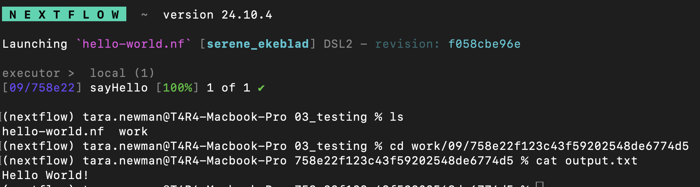

If we run `ls` in our directory, there is no file called "output.txt", but there is a new folder called "work". If we `cd` into the work directory, there's a another folder, and then another folder and then we get to a file called output.txt 

If we look beside the sayHello ***process*** in the nextflow output, there is `[09/758e22]` , these letters and numbers refer to the path inside the work directory where the output of that process is stored. These numbers will be unique everytime you run the pipeline. So if we run this same command again, there will be a new folder containing output.txt, and the initial output will **not** be overwritten. 


```python
cd work/09/758e22f123c43f59202548de6774d5 

cat output.txt
```

There is some more useful information in the nextflow output. Where it says `Launching 'hello_world.nf' [serene_ekeblad]`

`serene_ekeblad` is the run_name of the specific time you ran the script. This is always a random combination of an adjective + the last name of a scientist

Remember this because we will come back to this on Wednesday when we talk more about using and troubleshooting nextflow!

### Running Nextflow Pipelines from Github
In the `hello-world.nf` example, we were running nextflow scripts that were present in our current directory but you can also run any Nextflow pipeline that is available on Github.


For example, Nextflow has this simple pipeline: https://github.com/nextflow-io/socks

To run this, we just need the part of the repo URL after github.com

`nextflow-io/socks`

This is the username or organization , and the repo name


```python
nextflow run <repo name>
```


```python
nextflow run nextflow-io/socks
```

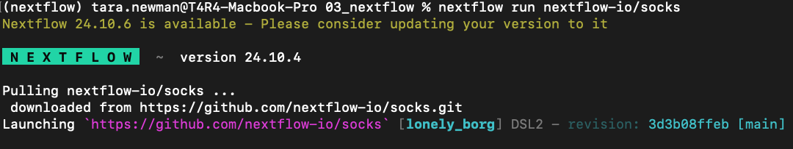

You can see the Nextflow pulled the needed code from Github and was able to run and execute it for you. 
You must run the code yourself to enjoy this pipeline :)

## Parameters

Parameters in Nextflow are variables passed to a workflow when it is executed. They allow users to customize pipeline runs without modifying the pipeline code by changing the parameters and their values. The Nextflow developer will determine the names of the parameters and should have documentation on what the parameters do and what the appropriate values are in the pipeline README or --help options.

Some important standard Nextflow parameters are: 

- `-resume`  : If you have a pipeline error that you fix, and want the pipeline to pick up where it left off , you can add -resume to your command to avoid re-running parts of the pipeline that already completed successfully. 
- `-profile` : This is where you specify the environment manager (where all your tools are) that you'll be using, ex: <conda,singularity,docker> 
- `--input` : This is where you specify the directory of your pipeline input. **Note**: The pipeline developer may have multiple different input parameters, or label this to be something else more appropriate to the pipeline, so be sure to read the documentation specific to your pipeline to determine how the input will be passed to your pipeline. 
- `--outdir` : This is where you specify the directory where you want the pipeline outputs located. 

Sometimes you just need to include the parameter as a flag, ex. the `-resume` parameter, or other times you need to pass a value along with the parameter. Ex. `--outdir <path/to/outdir>`

In our Nextflow socks example, the pipeline has a parameter called `--style` where you can change the style of socks that are output by entering either "emoji" or "socks" with the style parameter. Let's try it out!


```python
nextflow run nextflow-io/socks --style <emoji, socks>
```


Nextflow has a GUI console that uses [REPL](https://www.digitalocean.com/community/tutorials/what-is-repl) (read-eval-print loop) which allows you to test snippets of code interactively. You can launch it with the command `nextflow console`.

## Parts of a Nextflow Pipeline 

A Nextflow workflow is made from:

1. workflows
2. channels
3. processes 

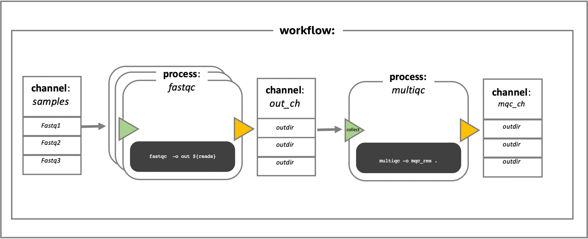

Let's dissect this further.


## 1. Workflow

The ***workflow*** in Nextflow organizes the processes and channels in the correct order, ie. the overall pipeline. 
As mentioned earlier, you can thing of this as similar to the `main()` function in a python script that calls other functions or in this case `processes`. In Nextflow it is defined using the *workflow* *scope*:

```
workflow {

< insert pipeline >

}
```

Most Nextflow pipelines will be some derivation of these basic files and structure:

- main.nf (where the ***workflow*** is specified)
- nextflow.config (where parameters that the user can adjust are defined - more on this later!)
- README.md ("docs, or it didn't happen")
- modules (other \*.nf files containing ***processes*** that are sourced by the main.nf)


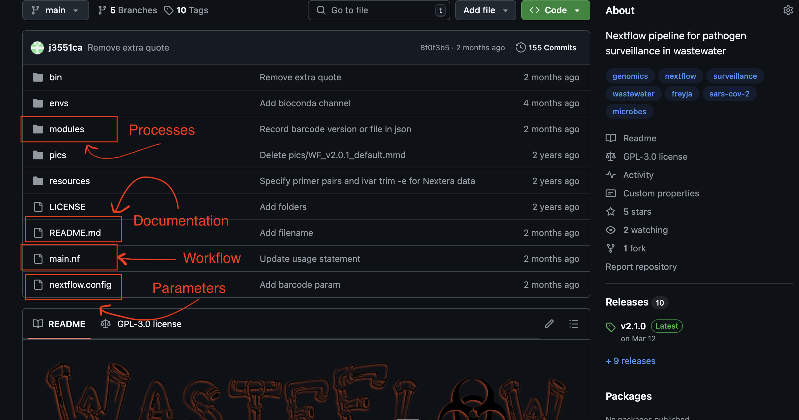


## 2. Channel

***Channels*** shuttle data around the workflow among processes. In Nextflow, a channel allows you take the outputs of one task and use them as inputs for the next. For example, it allows you to move the alignment file and its index (\*.bam & \*.bam.bai) you generated during the `align_reads` process that uses the tool BWA on to the next variant calling task/ process named `call_variants` which uses the software bcftools.


There are two types of channel in Nextflow:

1. value - stores a single value (ex. reference genome) which can be used by several processes an unlimited number of times
2. queue - consumed by a task to make the inputs of another (ex. fastq files that become trimmed reads which are the input for the read alignment task)

How do we make channels? In channel factories, of course!

Value channel factory:


```python
ch1 = Channel.value( 'GRCh38' )
ch2 = Channel.value( ['chr1', 'chr2', 'chr3', 'chr4', 'chr5'] )
```

Queue channel factory:


```python
Channel.of('a', 'b', 'c')
Channel.fromPath( '/data/bacteria/variants.vcf', checkIfExists: true ) // return error if the file does not exist
Channel.fromFilePairs('/my/data/sample*_{1,2}.fastq')
// [sampleEcoli, [/my/data/sampleEcoli_1.fastq, /my/data/sampleEcoli_2.fastq]]
// [sampleRsv, [/my/data/sampleRsv_1.fastq, /my/data/sampleRsv_2.fastq]]

// queries NCBI SRA to generate channel with fastq files matching study or sample ID
Channel.fromSRA('SRP043510') 
// [SRR1448794, ftp://ftp.sra.ebi.ac.uk/vol1/fastq/SRR144/004/SRR1448794/SRR1448794.fastq.gz]
// [SRR1448795, ftp://ftp.sra.ebi.ac.uk/vol1/fastq/SRR144/005/SRR1448795/SRR1448795.fastq.gz]
// [SRR1448792, ftp://ftp.sra.ebi.ac.uk/vol1/fastq/SRR144/002/SRR1448792/SRR1448792.fastq.gz]
Channel.fromList(['a', 'b', 'c', 'd'])
```

What do you notice about the outputs of the queue vs. value channels below, both using the same list initially:


```python
queue_ch = Channel.fromList(['a', 'b', 'c', 'd'])
queue_ch.view()
// a
// b
// c
// d

value_ch = Channel.value(['a', 'b', 'c', 'd'])
value_ch.view()
// [a, b, c, d]
```

#### Operators

***Operators*** *operate* on channels. There are operators that filter out items in a channel, apply math to channels, split a channel into multiple, combine multiple channels into one, and other operators like the handy ***view*** operator that allows you to see the items in a channel. Find the full list of Nextflow operators [here](https://www.nextflow.io/docs/latest/reference/operator.html).

You can apply operators to a specific channel using the following syntax:
`channel_name.operator()`

For example:


```python
// define a channel 
ch = channel.of('1', '2', '3')

// view the contents of that channel
ch.view()

// this also works:
ch = channel
.of('1', '2', '3')
.view()
```

Using the nextflow console, let's test how a few operators *operate* on the items in a channel.


```python
// define 2 channels - one named "letters" and the other named "numbers"
letters = channel.of('a', 'b', 'c')
numbers = channel.of('1','2','3')

// the concat operator
numbers
.concat(letters)
.view()

// the combine operator - cross product
numbers
.combine(letters)
.view()

// define a channel containing both numbers and letters
both = numbers.concat(letters).view()

// the filter operator - include digits only 
both
.filter(~/[0-9]/)
.view()
```

## 3. Process

A ***process*** is where commands are executed. In the `sayHello` process above, the command we ran was writing "Hello World!" to the `output.txt` file. We place commands or scripts we would normally run with CLI in a process. For example, if we were to index a viral reference genome for use with the aligner BWA, we would normally run the command `bwa index viral_genome.fasta`. Let's convert this into a Nextflow process named `index_ref`.


```python
process index_ref {

    script:
    """
    bwa index viral_genome.fasta
    """ 
    
  }
```

The script block is the bare minimum required by a process. By default, the command is interpreted as a Bash script. If you specify the shebang (#!) statement you can change the dafult scripting language, for example to python. Alternatively, for more extensive commands you can write a python script and source it in the script block, and Nextflow will find it in the `bin` directory that is on the same level as the workflow script that invokes them ie. `main.nf`: 


```python
process index_ref {

    script:
    """
    #!/usr/bin/env python

    num = 7

    if num > 5:
        print("Greater than 5")
    else:
        print("Not interested")
    """ 
  }
```


```python
  process index_ref {

    script:
    """
    detect_number.py --num 7
    """ 
  }
```

Back to our `bwa index viral_genome.fasta` example.. How do we get the viral_genome.fasta file from your computer into the `index_ref` process to be indexed? We can specify the `input` block. Here, we name the item that is coming from a channel to be used in the script block as `reference`. We can refer to the item coming from the channel using the `${ < item > }` syntax.


```python
process index_ref {
      
  input:                
  path(reference)

  script:
  """
  bwa index ${reference}
  """ 
}
```

The input is consumed by a task (`index_ref`) to make inputs for another process (ex. alignment). If you have indexed a reference using BWA before, you will know it generates several files: \*.amb, \*.ann, \*.bwt, \*.pac, \*.sa and that BWA-mem requires these to be in the same directory as your reference genome to efficiently align sequencing reads. How do we export these files to the next alignment process/ task? We specify the `output` block here. Note we can use pattern matching to ensure all desired files are included:


```python
process index_ref {
      
    input:                
    path(reference)
    
    output: 
    path("*.fasta.*")

    script:
    """
    bwa index ${reference}
    """ 
  }
```

In review: 
- we named the process - `index_ref`
- we specified a command in the script block - `bwa index viral_reference.fasta`
- we brought the reference genome into the process using the input block - `path(reference)`
- we sent the output files out of the process using the output block - `path("*.fasta.*")`


Great! Now how to run this? Remember, Nextflow pipelines are fundamentally made from 3 parts:
1. workflow
2. channels
3. processes


In the code snippet below, is the input channel to the process `index_ref` considered a queue or value channel? Why? 


```python
#!/usr/bin/enf nextflow

nextflow.enable.dsl=2


// the "function"
process index_ref {
      
  input:                
  path(reference)

  output:               
  path("*.fasta.*")

  script:
  """
  bwa index ${reference}
  """ 
}


// the "main function"
workflow {

// generate the queue channel containing the reference genome to be indexed
ref_ch = Channel.fromPath("/path/to/your/viral_genome.fasta")

// call the index_ref process we made, using reference genome as input
index_ref(ref_ch)

}
```

Tada! But wait - do you have BWA installed in there..? 

## Docker in Nextflow

Processes are isolated from the rest of the world. That is why you need to import and export data from them. Similarly, we need to define which virtual environment Nextflow should use for a given process. Without invoking the `nextflow.config` file which we will encounter later, this can be done as a directive in the process. In the last class we looked at Docker Hub registry which hosts docker images. Other registries include quay.io and GitHub container. BioContainers is a community project that makes conda and docker images (stored on quay.io) for bioinformatics tools. One advantage is that these docker images are usually built with multiple platforms in mind (linux/amd64 vs. linux/arm64), unlike some docker images you may encounter elsewhere. Search "bwa" and you should be able to find a docker image that suits your purpose.

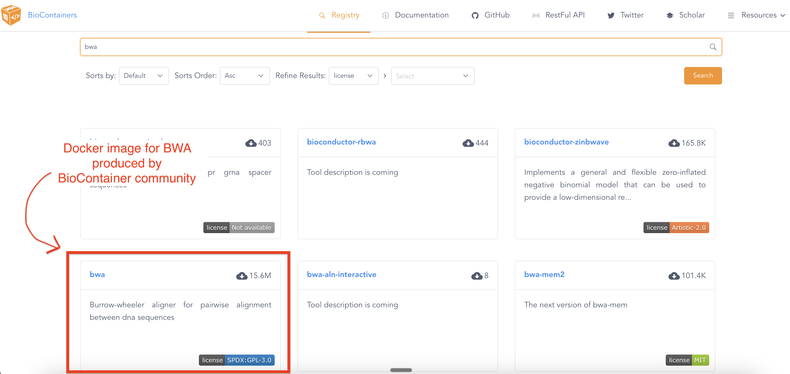


You can see the docker image and tag address specified once you click it:

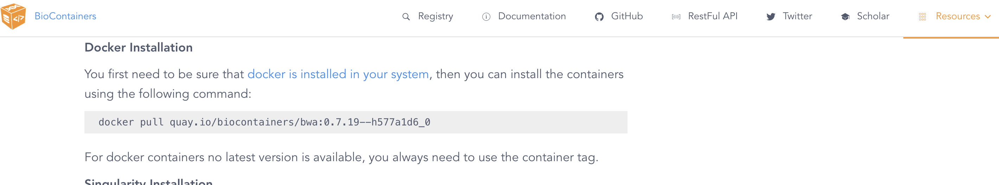


We paste the address to this container as the `container` directive in the process:


```python
#!/usr/bin/enf nextflow

nextflow.enable.dsl=2


// the "function"
process index_ref {
   
  // can also add < conda 'bwa' > here instead  
  container "quay.io/biocontainers/bwa:0.7.19--h577a1d6_0"
  publishDir "./indexed_ref/" // tells Nextflow which directory to publish results to
      
  input:                
  path(reference)

  output:               
  tuple path(reference), path("*.fasta*") // input files of a process are not included in default matching set

  script:
  """
  bwa index ${reference}
  """ 
}


// the "main function"
workflow {

// generate the queue channel containing the reference genome to be indexed
ref_ch = Channel.fromPath("/path/to/your/penguin_circovirus.fasta")

// call the index_ref process we made, using reference genome as input
index_ref(ref_ch)

}
```


You can test the above code snippet to see if you can index your reference genome in Nextflow. 

1. Download the penguin_circovirus.fasta file from our [class GitHub repo](https://github.com/uleth-advanced-bioinformatics/BCHM5420A-summer-2025/tree/main/resources/) into a directory of your choice.

1. Paste the code above into a file named index_ref.nf and remember to specify the path to the reference fasta file on your computer. 

1. Activate our conda virtual environment to get Nextflow


```python
conda activate uleth_advanced_bioinfo
```

4. Start Docker desktop - make sure it is running (you should see a whale in the menu bar)

5. Run Nextflow with docker enabled


```python
nextflow run index_ref.nf -with-docker true
```

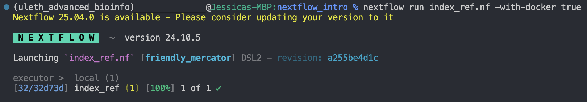


You may have noticed starting Docker desktop is quite a manual process (and requires root superuser privileges), which is fine when you are running pipelines locally on your laptop, but if you are using Nextflow on an HPC cluster, less than ideal. This is one of the reasons the purpose-built container runtime [Apptainer](https://apptainer.org/docs/user/latest/) (previously known as Singularity) is used on HPC servers.

## nf-core


**nf-core** is a community set standard of implementation for common bioinformatics workflows. It is a global community effort to collect a curated set of  **open-source, standardized, and production-ready bioinformatics pipelines** built using **Nextflow** 


All nf-core pipelines follow strict guidelines following community best practices and work in a consistent manner. This makes complex bioinformatics analysis **reproducible**, **accessible**, and **scalable** 


Watch an intro to nf-core [here](https://www.youtube.com/watch?v=gUM9acK25tQ&t=1s)

Top features of nf-core:
- **Community Standards:** Every pipeline follows strict best-practice guidelines.
- **Consistency:** All workflows work the same way—across tools, environments, and systems.
- **Trusted & Reusable:** These pipelines are vetted, stable, and widely adopted in research.
- **Open Source & Free:** All code is licensed under MIT and available on Github.
- **Flexible:** Use, modify, or fork any of the pipelines for your specific research needs.


Click [here]((https://nf-co.re/about) ) to learn a little bit more about nf-core. 

Explore the full list pipelines for your research project:  
[nf-core Pipelines](https://nf-co.re/pipelines/)


Join the [nf-core slack channel](https://nf-co.re/join/slack) and you'll have access to a community of experts on the pipelines you want to run. 


### Demo


Let's walk though running an nf-core pipeline. We will run the [nf-core/demo](https://nf-co.re/demo/1.0.1/)  (Credit: Chris Hakkaart (@christopher-hakkaart))

The pipeline will do the following:

1. Read QC (FASTQC)
2. Adapter and quality trimming (SEQTK_TRIM)
3. Present QC for raw reads (MULTIQC)


To run this pipeline, we will first need data


In Vim or VS code, make a new file called samplesheet.csv and copy the chunk below into your samplesheet.csv


```python
sample,fastq_1,fastq_2
SAMPLE1_PE,https://raw.githubusercontent.com/nf-core/test-datasets/viralrecon/illumina/amplicon/sample1_R1.fastq.gz,https://raw.githubusercontent.com/nf-core/test-datasets/viralrecon/illumina/amplicon/sample1_R2.fastq.gz
SAMPLE2_PE,https://raw.githubusercontent.com/nf-core/test-datasets/viralrecon/illumina/amplicon/sample2_R1.fastq.gz,https://raw.githubusercontent.com/nf-core/test-datasets/viralrecon/illumina/amplicon/sample2_R2.fastq.gz
SAMPLE3_SE,https://raw.githubusercontent.com/nf-core/test-datasets/viralrecon/illumina/amplicon/sample1_R1.fastq.gz,
SAMPLE3_SE,https://raw.githubusercontent.com/nf-core/test-datasets/viralrecon/illumina/amplicon/sample2_R1.fastq.gz,
```

In our sample sheet, SAMPLE1 and SAMPLE2 are paired end (PE) fastq files, and SAMPLE 3  we have a single end (SE). If you're curious, read [here](https://www.geneious.com/guides/assembling-dna-sequences#UGFpcmVkLWVuZCUyMHZzLiUyMFNpbmdsZS1lbmQ) for more information on PE vs SE read types. 


```python
nextflow run nf-core/demo \
   -profile <conda/docker/singularity> \
   --input samplesheet.csv \
   --outdir <OUTDIR>
```

In my example I am going to use conda:


```python
nextflow run nf-core/demo \
   -profile conda \
   --input samplesheet.csv \
   --outdir nf_core_demo_output
```


If we run this, we will see the process create the conda environment needed to run this pipeline. 

We will also see an error if we don't have enough memory, an issue you are likely to encounter on your own laptop.

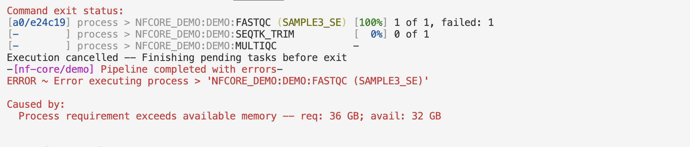


In the nf-core/demo base config file , located under **conf/base.config** , we can see there is something going on with how processes are labelled, and the amount of memory allocated to them.

https://github.com/nf-core/demo/blob/1.0.1/conf/base.config#L22


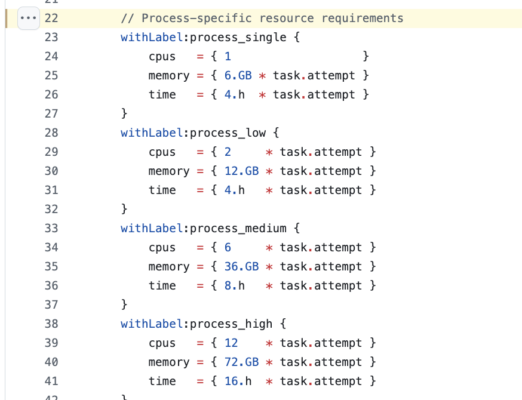


Our issue specifically with the **fastp** process.

So now if we look at the nf-core/demo github repository, the information is under modules/nf-core/fastqc/main.nf

https://github.com/nf-core/demo/blob/1.0.1/modules/nf-core/fastqc/main.nf#L3 

Here we can see that the process is labelled `process_medium`, 


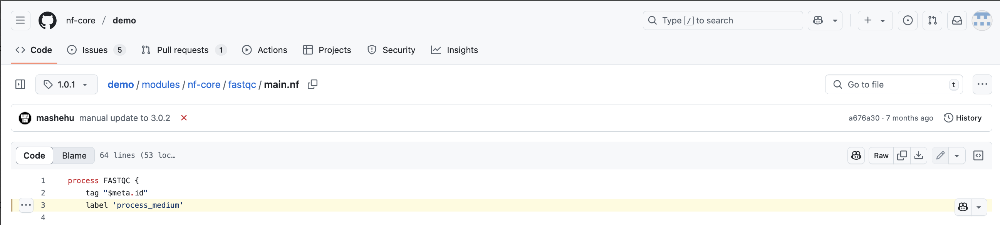


https://github.com/nf-core/demo/blob/1.0.1/conf/base.config#L33


In order to be able to run this on our computers, we will have to make a slight modification to the pipeline, and re-label this as `process_low` to reduce the memory requirements. 

<br>
 
To follow best practices, when we are making changes to a workflow we should make a copy of the nf-core/demo, either by forking the repository or copying it, and make these changes on a version controlled repository. However, we are just in troubleshooting mode, so let's see where we can edit this to test if this modifcation will be successful.

Let's open this file on our computers to edit the process label. **But where do we find this?**

<br>
 

Remember in the nextflow.io/socks example where Nextflow pulled the repository from Github? It is doing the same thing here from nf-core/demo repository. 


Nextflow stores the github repositories in this location on your computer:

- `~/.nextflow/.assets `

So since we are looking for the the `nf-core/demo` repository, and we know the file we want to edit is under `modules/nf-core/fastqc/main.nf` on this repository, then full path to the file is

`~/.nextflow/.assets/nf-core/demo/modules/nf-core/fastqc/main.nf`

Let's open this file now in VSCode so we can edit it(or your text editor of choice)


```python
code ~/.nextflow/assets/nf-core/demo/modules/nf-core/fastqc/main.nf 
```

Edit the process label and save the file.

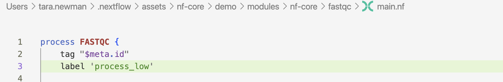

Now if we re-run the pipeline, we should have success! Let's use the `-resume` function we mentioned earlier to pick up where we left off!


```python
nextflow run nf-core/demo \
   -profile conda \
   --input samplesheet.csv \
   --outdir nf_core_demo_output \
   -resume
```

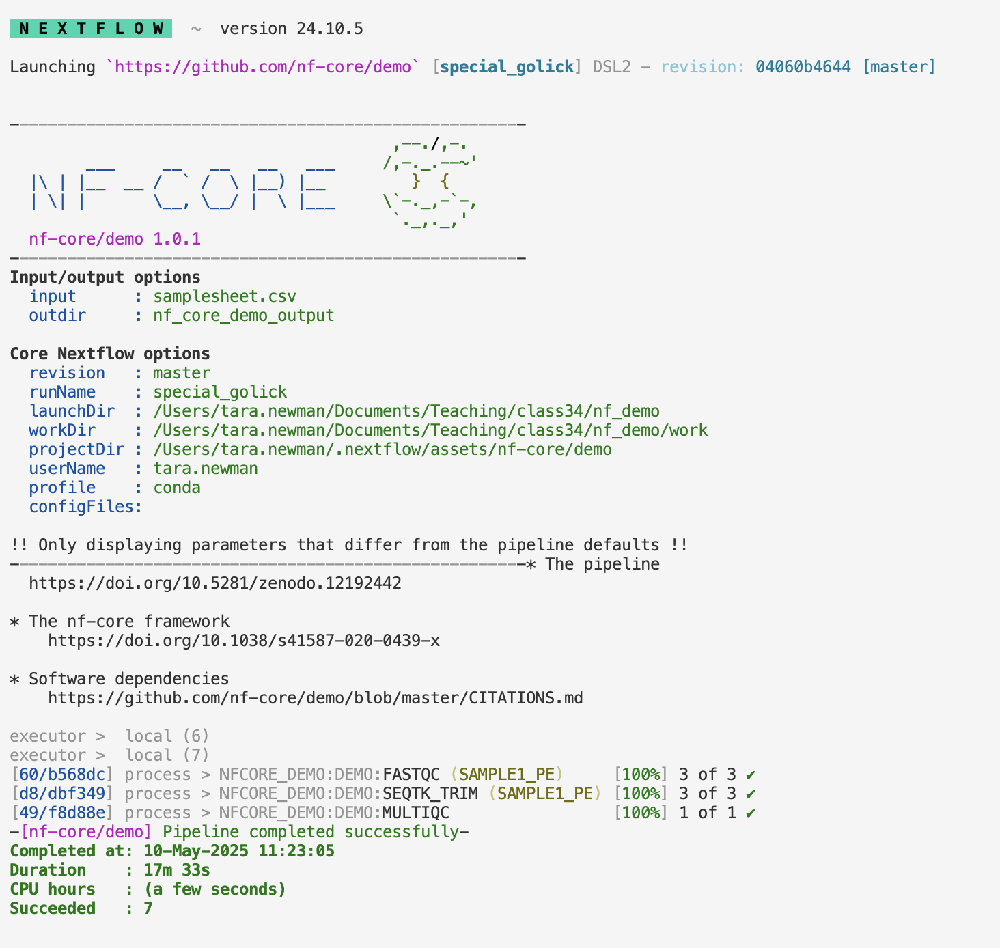

## Additional Learning
If you're interested in learning more about developing your own processes in nextflow, or learning more about the inner workings to adapt existing pipelines for your own purposes, we recommend checking out the many resources available online:

- https://training.nextflow.io/2.1.1/ 
- https://www.nextflow.io/docs/latest/

## Research Queston

Now that we've introduced you to some of the basics of Nextflow, now is a good time to think about pipeline you are interested in running for your final assignment

Some considerations:
- You'll be running this on your laptop. You must pick your input/workflow to be appropriate for your laptop. This may mean choosing a small virus or gene - ie. don't run TB. You may have to edit the process labels to use less memory like we did in the nf-core demo. 


Let's take some time now to consider the pipelines you want to use for your class project and try setting them up and troubleshoot together. 

## Recap

You have been familiarized with the workflow management system, ***Nextflow***, understood why it facilitates ***reproducible analyses***, how to run Nextflow pipelines, and resources including the ***nf-core*** community.  
