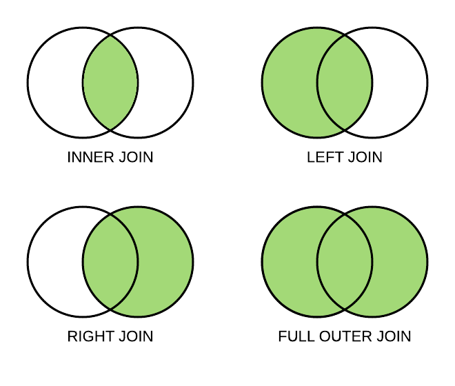
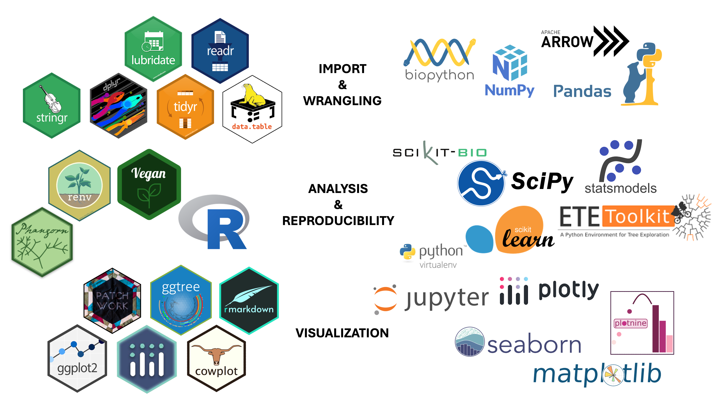
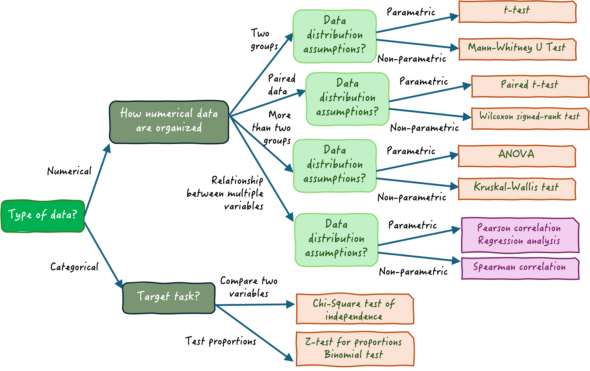
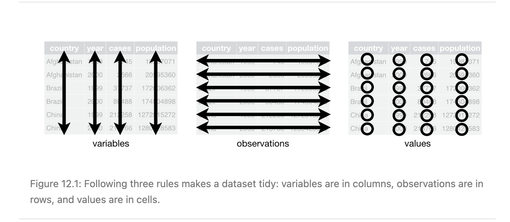
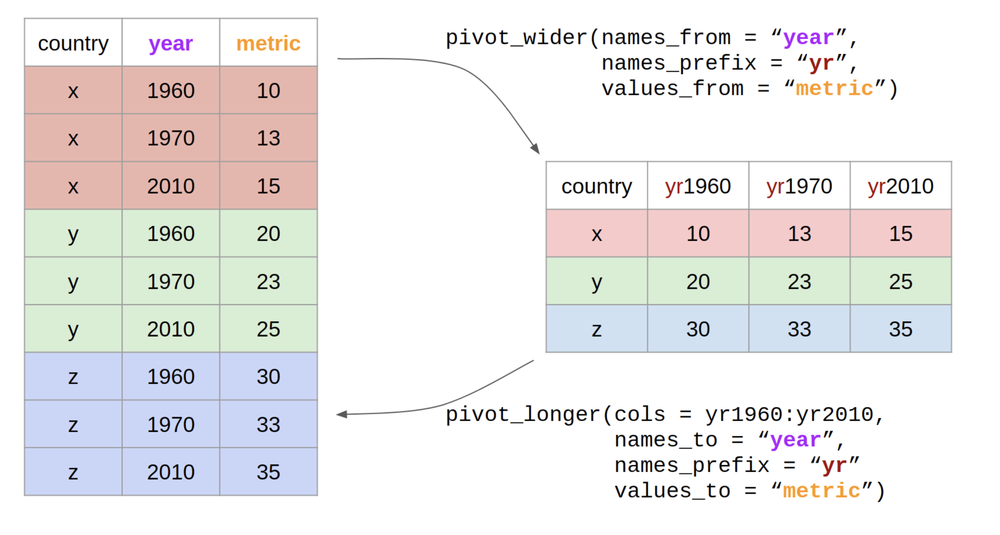
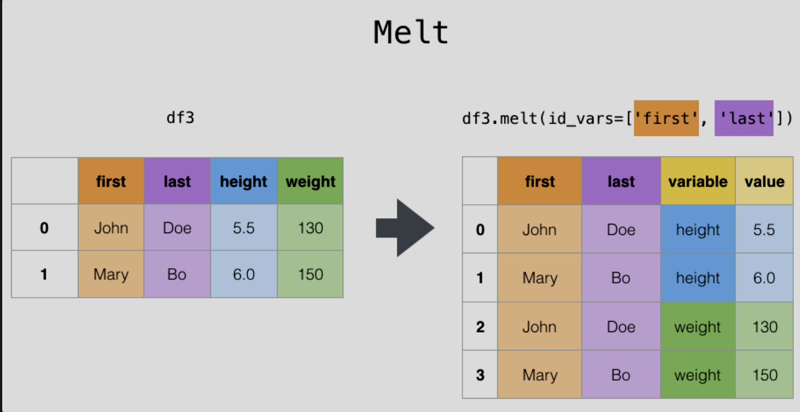
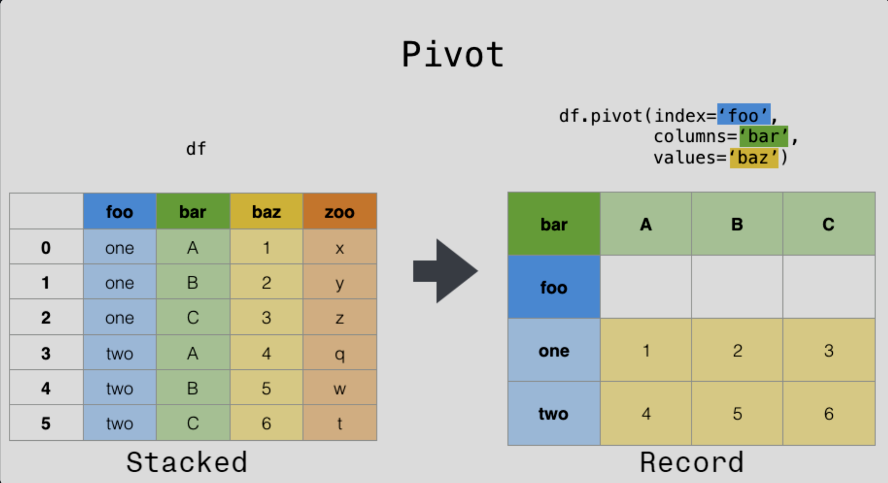

# Data Wrangling and Analysis

2025-05-21

Once you have your Nextflow pipeline outputs it is time to filter, format, and analyze them. This lesson looks at best practices and provides suggestions to help you extract meaningful conclusions through analysis of your data.

## Table of Contents

[Data Wrangling](#data-wrangling)<br>
[Metadata](#metadata)<br>
[R vs. Python](#r-vs.-python)<br>
[Joins](#joins)<br>
[Missing Data](#missing-data)<br>
[Useful Packages](#useful-packages)<br>
[Statistical Analyses](#statistical-analyses)<br>
[Data Reshaping and Tidy Data](#data-reshaping-and-tidy-data)<br>
[Exploratory Data Analysis](#exploratory-data-analysis)<br>
[Recap](#recap)<br>

## Data Wrangling

Hooray! Your bioinformatic (Nextflow) pipeline is producing files - alignment (\*.bam), variant calls (\*.vcf), consensus genomes (\*.fasta), and any number of formats depending on the pipeline. There may be an overwhelming number of outputs including some that summarize others, like the occasional pre-baked visualizations. Think about the answer you want to uncover from these results. Likely, satiating your curiosity will require further manipulation of one or more of these files. Before we begin analyzing our raw data, we must get it into a workable state or "wrangle" it.

As all definitions of the term "wrangling" suggest, this process is expected to take a while and involve frustration so take heart! If data wrangling is done well, you will make up for any lost time later in your analysis.


When we wrangle genomic data we are:

- importing data - this can be a feat in itself!
- ensuring values are formatted consistently - beware of dates!
- broadly checking the data makes sense (descriptive statistics)
- deciding how to handle missing data
- pulling in supplementary data

## Metadata

It is easy to be so focussed on the sequencing data and bioinformatic results that one forgets the metadata. Metadata is a crucial part of any analysis and key to gaining new insights. Metadata are usually stored as a crosswalk file that connects to associated sequencing data (ex. \*.csv file) and included information such as:

- collection date 
- host 
- geographical location
- sample type 
- clinical phenotype
- antimicrobial susceptibility phenotype

..and more! You may have downloaded this from NCBI, ENA, or DDBJ when you initially sourced your data. Metadata should be pulled in at the data wrangling step an connected to your Nextflow pipeline results. Any statistical analysis or modelling (ex. evoultionary using phylogenetics) will require some degree of metadata to produce a useful result.

Helpful command line tools for retrieving metadata are ENA's `enaBrowserTools` or NCBI's "Entrez Direct" or [`EDirect`](https://www.ncbi.nlm.nih.gov/books/NBK179288/), which allows users to search its various databases (ex. GenBank, SRA, PubMed, etc.). 


```python
conda activate uleth_advanced_bioinfo

conda install -c bioconda entrez-direct
```

If you experience complications with conda, try Docker!

1. open the docker app
1. check it is in your `$PATH` with `which docker` - it should return a directory that is in your `$PATH`
1. Run the following to pull the image containing `EDirect` from BioContainers:


```python
docker pull ncbi/edirect:latest

docker run --platform linux/amd64 -it --rm ncbi/edirect:latest

# test it is functional
esearch -help
```

Make a file called `sample_ids.txt` 


```python
touch sample_ids.txt
```

that contains a list of the following GenBank accesion IDs:


```python
MK905366.1
MT566276.1
OL539655.1
OL539639.1
```

EDirect has a few especially important commands: **epost**, **efetch**, and **xtract** which can be chained together. Use **esearch** when you are searching databases using text-based queries like `esearch -db nucleotide -query "SARS-CoV-2[orgn]"` as opposed to retrieving metadata for known project or sample IDs: `epost -db nucleotide -id "MN908947.3"`.


```python
docker run --platform linux/amd64 -it --rm -v </the/directory/with/your/sample_ids.txt>:/metadata ncbi/edirect:latest  \
bash -c "epost -db nucleotide -input /metadata/sample_ids.txt |  efetch -format docsum \
| xtract -pattern DocumentSummary -sep "," -element AccessionVersion,Title,SubName \
> /metadata/sample_metadata.csv"
```

Let's break this command down. 

- We first spin up the container from the docker image we pulled from `ncbi/edirect:latest` 
- Next, we need to bring the `sample_ids.txt` file into the container so we *mount* or "connect" the folder on your computer to the folder `metadata` in the container
- Then we pass our command into the container containing the `edirect` tool. We wrap the command in quotes and use bash -c because in this case we are running multiple commands (`epost`, `efetch`, `xtract`) and invoking shell features like pipes `|` and redirects `>`
- Finally, we write the resulting metadata to `/metadata/sample_metadata.csv` which is *inside* the container but also mounted to your folder *outside* the container, so you should see it in `</the/directory/with/your/sample_ids.txt>`!

What microbe do these sequences originate from?

## R vs. Python

At some point in data analysis, Excel stops excelling and you will need a programming language to manipulate your data. Two popular languages in genomic data science are R and Python. Both work! The choice you make may depend on familiarity, institution standards, or type of analysis (ex. machine learning - Python vs. vizualization - R). Here is a comparison to help you choose: 

| comparator |R |Python |
|:----------|:---|:-----|
| data science?| yes | yes | 
| release date | 1992 | 1989 | 
| general purpose | DSL (statistics & vizualization) | yes |
|open source | yes | yes |
| VS Code-compatible | yes - not as good as R Studio | yes |
| programming language | [functional](https://adv-r.hadley.nz/oo.html#:~:text=Generally%20in%20R%2C-,functional%20programming,-is%20much%20more) | object-oriented |

In the context of data wrangling, cleaning, and analysis R or Python have similar functionality. Here is a cheatsheet of some common functions in either language that you will likely need to use during your analysis:

| **Task**                  | **R (`dplyr`)**                                        | **Python (`pandas`)**                                |
|---------------------------|--------------------------------------------------------|------------------------------------------------------|
| Load CSV                  | `read_csv("file.csv")`                                 | `pd.read_csv("file.csv")`                            |
| View first rows           | `head(df)`                                             | `df.head()`                                          |
| Filter rows               | `filter(df, gene == "TP0548")`                           | `df[df["gene"] == "TP0548"]`                           |
| Select columns            | `select(df, sample_id, count)`                         | `df[["sample_id", "count"]]`                         |
| Rename columns            | `rename(df, gene_id = id)`                             | `df.rename(columns={"id": "gene_id"})`               |
| Create new column         | `mutate(df, ratio = count / total)`                   | `df["ratio"] = df["count"] / df["total"]`            |
| Group and summarize       | `group_by(df, sample) %>% summarize(mean = mean(count))` | `df.groupby("sample")["count"].mean()`              |
| Join tables               | `left_join(df1, df2, by = "id")`                       | `df1.merge(df2, on="id", how="left")`                |
| Pivot longer              | `pivot_longer(df, cols = starts_with("gene_"))`        | `df.melt(id_vars=..., value_vars=...)`               |
| Pivot wider               | `pivot_wider(df, names_from=gene, values_from=count)`  | `df.pivot(index=..., columns=..., values=...)`       |
| Drop NA rows              | `drop_na(df)`                                          | `df.dropna()`                                        |
| Fill missing values       | `replace_na(df, list(col = 0))`                        | `df["col"].fillna(0)`                                |
| Count rows by group       | `count(df, sample)`                                    | `df["sample"].value_counts()`                        |
| Sort rows                 | `arrange(df, desc(count))`                             | `df.sort_values(by="count", ascending=False)`        |
| Unique values             | `unique(df$gene)`                                   | `df["gene"].unique()`                                |
| Data types summary        | `glimpse(df)`                                          | `df.info()`                                          |

### Magrittr


You may have noticed the `%>%` symbol in the table above. This is like the command line pipe `|` equivalent in R and comes from the `magrittr` (as in [Magritte](https://en.wikipedia.org/wiki/The_Treachery_of_Images)) package as part of several data science oriented libraries, like `ggplot2` and `lubridate`, collectively known as the [`tidyverse`](https://www.tidyverse.org/). Note that the pipe has been part of the `dplyr` package since 2014, so this import is sufficient. The pipe operator is also available as `|>` in R v4.1+.

While Python technically has the `pandas` `df.pipe()` method or packages like `dfply` that use `>>` as pipes, it is less common to see pipe operators in Python. That is because Python is an [object-oriented](https://medium.com/@turkelturk/functional-vs-object-oriented-programming-through-data-engineering-6714c468067d) programming language. Instead, you will see method chaining (ex. `df.method1().method2()`) which effectively accomplishes the same tasks, like so:


```python
df.query('gene == "Neuraminidase"')[['sample_id', 'count']].sort_values(by='count', ascending=False)
```

## Joins

Oftentimes, you will want to *join* data frames together. For example, you would like to add metadata to your BioSample IDs. Knowing *how* you join them is important so you do not accidentally lose data.



<br>
<br>


Let's use the samples from the `EDirect` tutorial and ***join*** them to the associated metadata we retrieved from NCBI. Suppose we know whether each sample is caused severe disease/mortality in the host and was highly pathogenic avian influenza (HPAI) or ha mild/ no symptoms and was low pathogenic avian influenza (LPAI). Adjust the `sample_ids.txt` file so it looks like:


```python
MK905366.1 LPAI
OL539655.1 HPAI
AY854191.1 HPAI
```


```python
import pandas as pd

sample_ids = pd.read_csv("/</the/directory/with/your/sample_ids.txt>",
                         sep=" ",
                         names=["genbank_id", "pathogenicity"],
                         header=None)
metadata = pd.read_csv("</the/directory/with/your/sample_metadata.csv>",
                       names=["genbank_id", "isolate", "gene", "isolate_name","misc"],
                       header=None)

sample_ids.head()
```


```python
metadata.head()

```


<div>
<style scoped>
    .dataframe tbody tr th:only-of-type {
        vertical-align: middle;
    }

    .dataframe tbody tr th {
        vertical-align: top;
    }

    .dataframe thead th {
        text-align: right;
    }
</style>
<table border="1" class="dataframe">
  <thead>
    <tr style="text-align: right;">
      <th></th>
      <th>sample_id</th>
      <th>isolate</th>
      <th>gene</th>
      <th>isolate_name</th>
      <th>misc</th>
    </tr>
  </thead>
  <tbody>
    <tr>
      <th>0</th>
      <td>OL539655.1</td>
      <td>Influenza A virus (A/mallard/New York/AH017944...</td>
      <td>complete cds</td>
      <td>A/mallard/New York/AH0179440/2021|H3N1|AH01794...</td>
      <td>New York|6|oropharyngeal/cloacal swab pool fr...</td>
    </tr>
    <tr>
      <th>1</th>
      <td>OL539639.1</td>
      <td>Influenza A virus (A/mallard/New York/AH017940...</td>
      <td>complete cds</td>
      <td>A/mallard/New York/AH0179402/2021|H4N1|AH01794...</td>
      <td>New York|6|oropharyngeal/cloacal swab pool fr...</td>
    </tr>
    <tr>
      <th>2</th>
      <td>MT566276.1</td>
      <td>Influenza A virus (A/Mallard/Ohio/17OS1747/201...</td>
      <td>complete cds</td>
      <td>A/Mallard/Ohio/17OS1747/2017|H1N1|Anas platyrh...</td>
      <td>NaN</td>
    </tr>
    <tr>
      <th>3</th>
      <td>MK905366.1</td>
      <td>Influenza A virus (A/Green-Winged Teal/Califor...</td>
      <td>complete cds</td>
      <td>A/Green-Winged Teal/California/D1615825/2016|H...</td>
      <td>NaN</td>
    </tr>
  </tbody>
</table>
</div>


The VS Code extension `Data Wrangler` is helpful for data wrangling tasks!
<br>


<br>
<br>
We only want the metadata for the three samples in `sample_ids.txt` - which join should we use? 


```python
sample_meta = pd.merge(sample_ids, metadata, on="genbank_id", how="left")
sample_meta.head()
```


<div>
<style scoped>
    .dataframe tbody tr th:only-of-type {
        vertical-align: middle;
    }

    .dataframe tbody tr th {
        vertical-align: top;
    }

    .dataframe thead th {
        text-align: right;
    }
</style>
<table border="1" class="dataframe">
  <thead>
    <tr style="text-align: right;">
      <th></th>
      <th>sample_id</th>
      <th>pathogenicity</th>
      <th>isolate</th>
      <th>gene</th>
      <th>isolate_name</th>
      <th>misc</th>
    </tr>
  </thead>
  <tbody>
    <tr>
      <th>0</th>
      <td>MK905366.1</td>
      <td>LPAI</td>
      <td>Influenza A virus (A/Green-Winged Teal/Califor...</td>
      <td>complete cds</td>
      <td>A/Green-Winged Teal/California/D1615825/2016|H...</td>
      <td>NaN</td>
    </tr>
    <tr>
      <th>1</th>
      <td>OL539655.1</td>
      <td>HPAI</td>
      <td>Influenza A virus (A/mallard/New York/AH017944...</td>
      <td>complete cds</td>
      <td>A/mallard/New York/AH0179440/2021|H3N1|AH01794...</td>
      <td>New York|6|oropharyngeal/cloacal swab pool fr...</td>
    </tr>
  </tbody>
</table>
</div>


What will the resulting data frame look like if we perform an inner join?


```python
inner_df = pd.merge(sample_ids, metadata, on="genbank_id", how="inner")
inner_df.head()
```


<div>
<style scoped>
    .dataframe tbody tr th:only-of-type {
        vertical-align: middle;
    }

    .dataframe tbody tr th {
        vertical-align: top;
    }

    .dataframe thead th {
        text-align: right;
    }
</style>
<table border="1" class="dataframe">
  <thead>
    <tr style="text-align: right;">
      <th></th>
      <th>sample_id</th>
      <th>pathogenicity</th>
      <th>isolate</th>
      <th>gene</th>
      <th>isolate_name</th>
      <th>misc</th>
    </tr>
  </thead>
  <tbody>
    <tr>
      <th>0</th>
      <td>MK905366.1</td>
      <td>LPAI</td>
      <td>Influenza A virus (A/Green-Winged Teal/Califor...</td>
      <td>complete cds</td>
      <td>A/Green-Winged Teal/California/D1615825/2016|H...</td>
      <td>NaN</td>
    </tr>
    <tr>
      <th>1</th>
      <td>OL539655.1</td>
      <td>HPAI</td>
      <td>Influenza A virus (A/mallard/New York/AH017944...</td>
      <td>complete cds</td>
      <td>A/mallard/New York/AH0179440/2021|H3N1|AH01794...</td>
      <td>New York|6|oropharyngeal/cloacal swab pool fr...</td>
    </tr>
  </tbody>
</table>
</div>


Only the `genbank_id` `MK905366.1` & `OL539655.1` are shared between the `sample_ids` df and `metadata` df, so these are returned after an inner join.


## Missing Data

Is your data biologically missing or did you import it incorrectly? Assuming the former not the latter, a few options to handle missing data are:

1. deletion - completely remove observations with missing values
2. imputation - ex. substitute with the average of all values in the given attribute
3. filler - ex. use "Missing" which can be helpful in visulization so as not to produce misleading results
4. keep as-is

Whatever you choose, remember to document how you handled missing data because someone **will** ask you years later.  
If you choose to keep missing values, be aware of the potential effects this may have on certain functions. For example, filtering for anything that is not `penicillium_b` using `data.table` in `R`:


```python
library(data.table)

dt <- data.table(
  gene = c("pcbAB", "pcbC", "penDE", "cefEF", "cefG"),
  isolate_id = c("penicillium_a", NA, "penicillium_a", NA, "penicillium_b")
)

# this results in keeping only the genes from penicillium_a
dt[isolate_id!="penicillium_b", to_keep := "yes"]

# this will give the desired result which is keeping all the genes from penicillium_a and unknown isolates
dt[isolate_id!="penicillium_b" | is.na(isolate_id), to_keep := "yes"]
```


## Useful Packages

There is a whole host of libraries out there which can help you effectively leverage your data, each with their own specialty. The following is a summary of some bioinformatic staples in R and Python as a starting point.




Of special note:

- pandas - the "swiss army knife" that can import, slice, join, filter, and describe data
- data.table - a C++ implemented, memory-efficient, faster alternative to `dplyr` that uses a SQL syntax
- renv and venv - helpful for reproducibility of analysis as they "bundle" up other packages for sharing
- phangorn and ete3 - phylogenetic utilities
- biopython - a Python library designed specifically for biology with modules for working with alignments, population genetics, and more!
- ggplot2 - "grammar of graphics" which builds publication-quality figures using layers or "geoms" (ex. `ggplot() + geom_bar() + geom_point()`)

## Statistical Analyses

You will notice some packages for ***statistics*** such as `statsmodels` or `vegan`. It is important to remember to formalize observations made from your data with statistical tests. This is a crucial part of data analysis and quantifies your observations in a way that can be tested for significance. Always remember to look up the assumptions underlying a statistical test to see whether your data adhere or violate them and warrant a different test. For example, testing the relationship between variables using a linear regression assumes:

- **L**inearity - the relationship appears to form a straight line
- **I**ndependence - the observations are independent of each other
- **N**ormality of Residuals - the residuals are normally distributed
- **E**qual variance - also known as homoscedasticity, which is the constant spread of residuals.

The very first assumption that is broadly applicable to a number of statistical tests which you can explore in your data is whether you have parametric or non-parametric data. Simply put, does the data you are working with follow a normal distribution or not? Perhaps it looks skewed? Are your data qualitative (ex. categories - lineage names) or quantitative (ex. continuous - % genome coverage)? Are you comparing more than one group? How many? Next, is your data paired or unpaired? An example of paired data would be the results of a clinical trial where the symptoms of the same individuals were measured twice - once before treatment with a new drug and once afterwards. The same samples (not independent) underwent multiple treatments. 

These questions will get you a decent way to choosing the correct statistical test for your purpose.

See [this](https://www.statology.org/choosing-the-right-statistical-test-a-decision-tree-approach/) article for more information.




## Data Reshaping and Tidy data 

You may compile a messy dataset yourself or be handed one that is a mess. While it is definitely possible to work with messy data, taking the time to clean it first will save you time downstream and make your life much, much easier (speaking from hard-earned experience).

Data cleaning — what does this mean? No soap and water involved - we're using functions to ensure our data is in a format that is easily compatible with downstream analysis tools and workflows.

The following section was adapted from [R for Data Science by Hadley Wickham & Garrett Grolemund](https://r4ds.had.co.nz/tidy-data.html), which focuses on the tidyR R package where the functions are designed to work best with this type of data but the underlying principles apply just as well to pandas dataframes or any other tool of your choice.

“Happy families are all alike; every unhappy family is unhappy in its own way.” –– Leo Tolstoy

“Tidy datasets are all alike, but every messy dataset is messy in its own way.” –– Hadley Wickham


If we can tidy our data in a consistent, ***reproducible way***, it allows ourselves and others to work more efficiently and easily with the data. As well, dplyr, ggplot2 and all the functions in the tidyverse are designed to work with data in this format. This means less work for you each time you want to use these functions. If you're not familiar with the tidyverse, it is a collection of R packages that share an underlying design philosophy, grammar, and data structures.


### Example 
Let's work with this dataset containing genotypic and phenotypic data for *Mycobacterium tuberculosis* antimicrobial resistance (AMR).

The phenotypic data was taken from [Coll et al.](https://genomemedicine.biomedcentral.com/articles/10.1186/s13073-015-0164-0#citeas). The `Accession` refers to the sample identifier from the SRA. The acronyms (`AMK` = Amikacin, `CAPREO` = Capreomycin etc.) indicate the antibiotics for which the sample was tested for phenotypic susceptibility.

This dataset has been joined with AMR prediction results from a tool called TBProfiler. For each antibiotic (`Amikacin`, `Capreomycin`, `Ethambutol` etc.), the output lists any detected mutations known to confer resistance to that drug. For example, embB p.Met306Val (1) indicates a mutation in the embB gene at amino acid position 306, where a Methionine (Met) has mutated to a Valine (Val). The "(1)" shows that the mutation is present at an allele fraction of 1, or 100%.

At first glance, what stands out to you as potentially problematic in this dataset?


|Accession  |AMK |CAPREO |E  |ETHI |MXF |I  |KANA |OFLO |PAS |PZA |R  |S  |Amikacin             |Capreomycin          |Ethambutol              |Ethionamide           |Moxifloxacin    |Isoniazid               |Kanamycin            |Ofloxacin            |Para-aminosalicylic acid |Pyrazinamide            |Rifampicin           |Streptomycin           |
|:----------|:---|:------|:--|:----|:---|:--|:----|:----|:---|:---|:--|:--|:--------------------|:--------------------|:-----------------------|:---------------------|:-------------------------------|:-----------------------|:--------------------|:--------------------|:------------------------|:-----------------------|:--------------------|:----------------------|
|ERR1036286 |S   |S      |R  |R    |NA  |R  |NA   |S    |NA  |R   |R  |R  |No mutation detected |No mutation detected |embB p.Met306Val (1)    |ethA c.180delC (0.99) |No mutation detected            |katG p.Ser315Thr (1)    |No mutation detected |No mutation detected |thyX c.-16C>T (1)        |pncA p.Asp63Ala (1)     |rpoB p.Ser450Leu (1) |rpsL p.Lys43Arg (1)    |
|ERR1036287 |S   |S      |NA |R    |NA  |NA |S    |S    |S   |NA  |NA |NA |No mutation detected |No mutation detected |embB p.Met306Leu (1)    |ethA c.110delA (0.98) |No mutation detected            |katG p.Ser315Thr (1)    |No mutation detected |No mutation detected |No mutation detected     |pncA p.Gln141Pro (0.98) |rpoB p.Ser450Leu (1) |rpsL p.Lys43Arg (0.99) |
|ERR1036288 |S   |S      |NA |R    |NA  |NA |S    |S    |S   |NA  |NA |NA |No mutation detected |No mutation detected |embB p.Gly406Asp (0.99) |No mutation detected  |No mutation detected            |katG p.Ser315Thr (0.99) |No mutation detected |No mutation detected |No mutation detected     |pncA p.Gly97Cys (0.99)  |rpoB p.His445Asn (1) |gid p.Ser136* (0.99)   |
|ERR1036289 |S   |S      |R  |R    |NA  |R  |R    |R    |NA  |S   |R  |R  |No mutation detected |No mutation detected |embA c.-11C>A (1)       |fabG1 c.-15C>T (1)    |gyrA p.Ser91Pro (1)             |fabG1 c.-15C>T (1)      |eis c.-10G>A (1)     |gyrA p.Ser91Pro (1)  |No mutation detected     |No mutation detected    |rpoB p.Ser450Leu (1) |rpsL p.Lys43Arg (1)    |
|ERR1036290 |S   |S      |S  |R    |NA  |R  |S    |R    |S   |R   |R  |R  |No mutation detected |No mutation detected |embA c.-11C>A (1)       |fabG1 c.-15C>T (1)    |gyrA p.Ser91Pro (1)             |fabG1 c.-15C>T (1)      |eis c.-10G>A (1)     |gyrA p.Ser91Pro (1)  |No mutation detected     |No mutation detected    |rpoB p.Ser450Leu (1) |rpsL p.Lys43Arg (1)    |
|ERR1036291 |R   |R      |R  |R    |NA  |R  |R    |R    |S   |R   |R  |S  |rrs n.1401A>G (1)    |rrs n.1401A>G (1)    |embB p.Met306Val (1)    |fabG1 c.-15C>T (1)    |gyrA p.Asp94Ala (1)             |fabG1 c.-15C>T (1)      |rrs n.1401A>G (1)    |gyrA p.Asp94Ala (1)  |No mutation detected     |pncA p.Val125Gly (1)    |rpoB p.Ser450Leu (1) |gid p.Ala80Pro (1)     |
|ERR1036292 |S   |S      |NA |S    |NA  |NA |S    |S    |S   |NA  |NA |NA |No mutation detected |No mutation detected |embB p.Gly406Cys (0.99) |No mutation detected  |No mutation detected            |katG p.Ser315Thr (1)    |No mutation detected |No mutation detected |No mutation detected     |No mutation detected    |No mutation detected |rpsL p.Lys43Arg (1)    |
|ERR1036293 |R   |R      |NA |R    |NA  |NA |R    |S    |S   |NA  |NA |NA |rrs n.1401A>G (1)    |rrs n.1401A>G (1)    |embB p.Met306Val (1)    |fabG1 c.-15C>T (0.99) |No mutation detected            |fabG1 c.-15C>T (0.99)   |rrs n.1401A>G (1)    |No mutation detected |No mutation detected     |pncA p.Val125Gly (1)    |rpoB p.Ser450Leu (1) |gid p.Ala80Pro (1)     |
|ERR1036294 |R   |R      |R  |R    |NA  |R  |R    |R    |S   |R   |R  |R  |rrs n.1484G>T (1)    |rrs n.1484G>T (1)    |embA c.-16C>G (1)       |fabG1 c.-15C>T (1)    |gyrA p.Asp94Gly (1)             |fabG1 c.-15C>T (1)      |rrs n.1484G>T (1)    |gyrA p.Asp94Gly (1)  |No mutation detected     |pncA p.Phe13Leu (1)     |rpoB p.Ser450Leu (1) |rpsL p.Lys43Arg (1)    |
|ERR1036295 |S   |S      |NA |R    |NA  |NA |S    |R    |S   |NA  |NA |NA |No mutation detected |No mutation detected |embB p.Met306Val (1)    |fabG1 c.-15C>T (1)    |gyrA p.Asp94Val (1)             |fabG1 c.-15C>T (1)      |No mutation detected |gyrA p.Asp94Val (1)  |No mutation detected     |pncA p.Val125Gly (1)    |rpoB p.Ser450Leu (1) |gid p.Ala80Pro (1)     |
|ERR1036296 |R   |R      |S  |R    |NA  |R  |R    |R    |S   |R   |R  |R  |rrs n.1484G>T (0.99) |rrs n.1484G>T (0.99) |embA c.-16C>G (1)       |fabG1 c.-15C>T (1)    |gyrA p.Asp94Gly (1)             |fabG1 c.-15C>T (1)      |rrs n.1484G>T (0.99) |gyrA p.Asp94Gly (1)  |No mutation detected     |pncA p.Phe13Leu (1)     |rpoB p.Ser450Leu (1) |rpsL p.Lys43Arg (1)    |
|ERR1036297 |S   |S      |NA |S    |NA  |NA |S    |S    |S   |NA  |NA |NA |No mutation detected |No mutation detected |embB p.Gln497Arg (1)    |No mutation detected  |No mutation detected            |katG p.Ser315Thr (1)    |No mutation detected |No mutation detected |No mutation detected     |No mutation detected    |No mutation detected |rpsL p.Lys43Arg (1)    |
|ERR1036298 |S   |S      |NA |S    |NA  |NA |NA   |S    |NA  |NA  |NA |NA |No mutation detected |No mutation detected |embB p.Met306Ile (0.44) |No mutation detected  |No mutation detected            |katG c.268dupT (0.95)   |No mutation detected |No mutation detected |No mutation detected     |No mutation detected    |rpoB p.Ser450Leu (1) |gid p.Gln127* (0.21)   |


The AMR results, in particular, are formatted in a way that could be considered more human-readable—efficient for scanning left to right—but not structured in a way that is easily transformable or code-friendly.


### Tidy Rules

To make the data easier to manipulate and analyze, we can reshape it using the principles of tidy data.

The three tidy rules to live by: 

1. Each variable must have its own column.
2. Each observation must have its own row.
3. Each value must have its own cell.





- Bonus rule - if you have multiple datasets, a common column should be used to link them (primary key), for example - `Accession` or `SampleID`


How can we apply these principles to tidy our table? 

- What would we consider the variables in the dataset?
- What would we consider an observation in this dataset?


---

**Rule 1: Each variable must have its own column.**

**Issue:**

Our dataframe breaks this rule because each drug has two associated columns:

- One for the **phenotypic result** (e.g., `AMK`, `CAPREO`, `E`, etc.)
- One for the **genotypic result** (e.g., `Amikacin`, `Capreomycin`, `Ethambutol`, etc.)

This means the `drug` variable is not represented in a single column. Instead, each drug is treated as its own separate variable.

In tidy data, there should be a single `drug` column where the values include the antibiotics *Amikacin*, *Capreomycin*, etc.

Currently, there is no column that captures the `drug` variable on its own because the values are distributed across multiple columns.


---

**Rule 2: Each observation must have its own row.**


**Issue**:  Each row currently represents a sample (identified uniquely by the `Accession`), but it includes results for multiple drugs and their phenotypic and genotypic results.

This means that each row contains multiple observations — one for each drug tested — rather than a single observation per row. In tidy data, an observation should represent a single unit of measurement: in this case, a specific sample–drug-phenotype-genotype observation.


---

**Bonus Rule: if you have multiple datasets - a common column should be used to link them**


Our current dataframe can be joined to other datasets using the `Accession` column (which identifies the sample), but not by `drug`.

What if we want to join our dataset with one that includes:

- Drug concentrations used for phenotypic testing  
- Drug-specific performance metrics (e.g., positive predictive value of a specific mutation that confers resistance to the drug)

In its current structure, this kind of join is not feasible because `drug` is not a standalone variable.


---

**Solution**

The following solution resolves the issues with rules 1 and 2 (and our bonus rule by proxy)


Reshape the dataset into a long format where each row corresponds to a unique combination of:

- Accession

- Drug (e.g., Amikacin, Capreomycin, etc.)

- Phenotype (e.g., S, R, NA)

- Mutation (e.g., "rrs n.1401A>G (1)", "No mutation detected", etc.)

This way, the variable `Drug` is preserved as a single column, and its associated phenotypic and genotypic values are captured properly.


Right now, respective to the drug information, our dataset is wide, meaning it spreads multiple pieces of information across columns. To apply the tidy principles, we need to reshape it into a long format, where each row represents one observation about one sample and one drug.


### Pivot functions 


To implement our solution, we'll need to use functions to reshape our data.


**R**

In R, we can use the functions  `pivot_longer` and `pivot_wider`from the **tidyR** package to reshape our data. In our case we will need the `pivot_longer` function. 


<br>


[Image source](https://tavareshugo.github.io/r-intro-tidyverse-gapminder/09-reshaping/index.html)<br>


**Python**

In our example, we will be going over the solution in R, but the equivalent functions in Python are `pd.melt()` and `pd.pivot()` from pandas 

<br>

<br>

[Image Source](https://pandas.pydata.org/docs/user_guide/reshaping.html)


### Implementation 
The first step is to import our data and pivot the phenotypic columns. 


```python
library(readr)
library(knitr)
library(tidyverse)
amr_genotypic_phenotypic_results <- read_csv("BCHM5420A-summer-2025/resources/class5_amr_data_cleaning_example.csv")


## Step 1: Pivot the phenotypic columns

tidy_phenotypic <- amr_genotypic_phenotypic_results %>% 
select(c(Accession, AMK: S)) %>% # select only the accession (sample identifier) and phenotypic columns 
  pivot_longer(
    cols = c(AMK: S),   # columns to be collapsed into a two variables: 1 containing the names of these columns and 1 containing their contents 
    names_to = "Drug_phenotypic", 
    values_to = "Phenotype"
  )

# Python Equivalent
```
tidy_phenotypic = amr_genotypic_phenotypic_results.melt(
    id_vars=['Accession'],                 # Keep Accession as identifier
    value_vars=['AMK', 'CAPREO', 'E', 'ETHI', 'MXF', 'I', 'KANA', 'OFLO', 'PAS', 'PZA', 'R', 'S'],  # Phenotypic columns
    var_name='Drug_phenotypic',            # Name for melted column names
    value_name='Phenotype'                 # Name for melted values
)
```

kable(head(tidy_phenotypic, 12), format = "markdown")
```


**Original**


|Accession  |AMK |CAPREO |E  |ETHI |MXF |I  |KANA |OFLO |PAS |PZA |R  |S  |Amikacin             |Capreomycin          |Ethambutol              |Ethionamide           |Moxifloxacin    |Isoniazid               |Kanamycin            |Ofloxacin            |Para-aminosalicylic acid |Pyrazinamide            |Rifampicin           |Streptomycin           |
|:----------|:---|:------|:--|:----|:---|:--|:----|:----|:---|:---|:--|:--|:--------------------|:--------------------|:-----------------------|:---------------------|:-------------------------------|:-----------------------|:--------------------|:--------------------|:------------------------|:-----------------------|:--------------------|:----------------------|
|ERR1036286 |S   |S      |R  |R    |NA  |R  |NA   |S    |NA  |R   |R  |R  |No mutation detected |No mutation detected |embB p.Met306Val (1)    |ethA c.180delC (0.99) |No mutation detected            |katG p.Ser315Thr (1)    |No mutation detected |No mutation detected |thyX c.-16C>T (1)        |pncA p.Asp63Ala (1)     |rpoB p.Ser450Leu (1) |rpsL p.Lys43Arg (1)    |

**tidy_phenotypic**

|Accession  |Drug_phenotypic |Phenotype |
|:----------|:---------------|:---------|
|ERR1036286 |AMK             |S         |
|ERR1036286 |CAPREO          |S         |
|ERR1036286 |E               |R         |
|ERR1036286 |ETHI            |R         |
|ERR1036286 |MXF             |NA        |
|ERR1036286 |I               |R         |
|ERR1036286 |KANA            |NA        |
|ERR1036286 |OFLO            |S         |
|ERR1036286 |PAS             |NA        |
|ERR1036286 |PZA             |R         |
|ERR1036286 |R               |R         |
|ERR1036286 |S               |R         |

Observe how we've effectively condensed the 12 Phenotypic columns to 2: Drug_phenotypic and Phenotype


Now, let's repeat this with the genotypic results.


```python
# Step 2: Pivot genotypic columns 
tidy_genotypic <- amr_genotypic_phenotypic_results %>%
  select(c(Accession, Amikacin:Streptomycin)) %>% # selecting the Accession (sample identifier) and the genotypic colums 
  pivot_longer(
    cols = c(Amikacin:Streptomycin),  # genotypic columns 
    names_to = "Drug_genotypic",
    values_to = "Genotype"
  )

  kable(head(tidy_genotypic, 12), format = "markdown")

```

**Original**


|Accession  |AMK |CAPREO |E  |ETHI |MXF |I  |KANA |OFLO |PAS |PZA |R  |S  |Amikacin             |Capreomycin          |Ethambutol              |Ethionamide           |Moxifloxacin    |Isoniazid               |Kanamycin            |Ofloxacin            |Para-aminosalicylic acid |Pyrazinamide            |Rifampicin           |Streptomycin           |
|:----------|:---|:------|:--|:----|:---|:--|:----|:----|:---|:---|:--|:--|:--------------------|:--------------------|:-----------------------|:---------------------|:-------------------------------|:-----------------------|:--------------------|:--------------------|:------------------------|:-----------------------|:--------------------|:----------------------|
|ERR1036286 |S   |S      |R  |R    |NA  |R  |NA   |S    |NA  |R   |R  |R  |No mutation detected |No mutation detected |embB p.Met306Val (1)    |ethA c.180delC (0.99) |No mutation detected            |katG p.Ser315Thr (1)    |No mutation detected |No mutation detected |thyX c.-16C>T (1)        |pncA p.Asp63Ala (1)     |rpoB p.Ser450Leu (1) |rpsL p.Lys43Arg (1)    |

**tidy_genotypic**

|Accession  |Drug_genotypic                  |Genotype              |
|:----------|:-------------------------------|:---------------------|
|ERR1036286 |Amikacin                        |No mutation detected  |
|ERR1036286 |Capreomycin                     |No mutation detected  |
|ERR1036286 |Ethambutol                      |embB p.Met306Val (1)  |
|ERR1036286 |Ethionamide                     |ethA c.180delC (0.99) |
|ERR1036286 |Moxifloxacin                    |No mutation detected  |
|ERR1036286 |Isoniazid                       |katG p.Ser315Thr (1)  |
|ERR1036286 |Kanamycin                       |No mutation detected  |
|ERR1036286 |Ofloxacin                       |No mutation detected  |
|ERR1036286 |Para-aminosalicylic acid        |thyX c.-16C>T (1)     |
|ERR1036286 |Pyrazinamide                    |pncA p.Asp63Ala (1)   |
|ERR1036286 |Rifampicin                      |rpoB p.Ser450Leu (1)  |
|ERR1036286 |Streptomycin                    |rpsL p.Lys43Arg (1)   |

Again, in this table, we've condensed the genotypic results from 12 genotypic columns to 2: Drug_genotypic and Genotype.


Next, we will need to map the matching phenotypic and genotypic columns, so that we can merge the two dataframes together. 


```python
# Step 3: Create a vector to map phenotypic col names to genotypic column names
mapping <- c(
  AMK = "Amikacin",
  CAPREO = "Capreomycin",
  E = "Ethambutol",
  ETHI = "Ethionamide",
  MXF = "Moxifloxacin",
  I = "Isoniazid",
  KANA = "Kanamycin",
  OFLO = "Ofloxacin",
  PAS = "Para-aminosalicylic acid",
  PZA = "Pyrazinamide",
  R = "Rifampicin",
  S = "Streptomycin"
)

# 4. Add full drug names to phen_long for join
tidy_phenotypic <- tidy_phenotypic %>%
  mutate(Drug = mapping[Drug_phenotypic])

kable(head(tidy_phenotypic, 12), format = "markdown")
```

**tidy_phenotypic**

|Accession  |Drug_phenotypic |Phenotype |Drug                            |
|:----------|:---------------|:---------|:-------------------------------|
|ERR1036286 |AMK             |S         |Amikacin                        |
|ERR1036286 |CAPREO          |S         |Capreomycin                     |
|ERR1036286 |E               |R         |Ethambutol                      |
|ERR1036286 |ETHI            |R         |Ethionamide                     |
|ERR1036286 |MXF             |NA        |Moxifloxacin                    |
|ERR1036286 |I               |R         |Isoniazid                       |
|ERR1036286 |KANA            |NA        |Kanamycin                       |
|ERR1036286 |OFLO            |S         |Ofloxacin                       |
|ERR1036286 |PAS             |NA        |Para-aminosalicylic acid        |
|ERR1036286 |PZA             |R         |Pyrazinamide                    |
|ERR1036286 |R               |R         |Rifampicin                      |
|ERR1036286 |S               |R         |Streptomycin                    |


We've now added a column called "Drug" that we can use to join with the genotypic data.

Now for our final transformation, we can join the two together to create our tidy dataset that satisfies rules 1 and 2. 


```python
# 5. Join on Accession and Drug name
tidy_amr_results <- tidy_phenotypic %>%
  left_join(tidy_genotypic, by = c("Accession", "Drug" = "Drug_genotypic")) %>%
  select(Accession, Drug, Phenotype, Genotype)

kable(head(tidy_amr_results, 12), format = "markdown")

```

**Original**


|Accession  |AMK |CAPREO |E  |ETHI |MXF |I  |KANA |OFLO |PAS |PZA |R  |S  |Amikacin             |Capreomycin          |Ethambutol              |Ethionamide           |Moxifloxacin    |Isoniazid               |Kanamycin            |Ofloxacin            |Para-aminosalicylic acid |Pyrazinamide            |Rifampicin           |Streptomycin           |
|:----------|:---|:------|:--|:----|:---|:--|:----|:----|:---|:---|:--|:--|:--------------------|:--------------------|:-----------------------|:---------------------|:-------------------------------|:-----------------------|:--------------------|:--------------------|:------------------------|:-----------------------|:--------------------|:----------------------|
|ERR1036286 |S   |S      |R  |R    |NA  |R  |NA   |S    |NA  |R   |R  |R  |No mutation detected |No mutation detected |embB p.Met306Val (1)    |ethA c.180delC (0.99) |No mutation detected            |katG p.Ser315Thr (1)    |No mutation detected |No mutation detected |thyX c.-16C>T (1)        |pncA p.Asp63Ala (1)     |rpoB p.Ser450Leu (1) |rpsL p.Lys43Arg (1)    |


**tidy_amr_results**

|Accession  |Drug                            |Phenotype |Genotype              |
|:----------|:-------------------------------|:---------|:---------------------|
|ERR1036286 |Amikacin                        |S         |No mutation detected  |
|ERR1036286 |Capreomycin                     |S         |No mutation detected  |
|ERR1036286 |Ethambutol                      |R         |embB p.Met306Val (1)  |
|ERR1036286 |Ethionamide                     |R         |ethA c.180delC (0.99) |
|ERR1036286 |Moxifloxacin                    |NA        |No mutation detected  |
|ERR1036286 |Isoniazid                       |R         |katG p.Ser315Thr (1)  |
|ERR1036286 |Kanamycin                       |NA        |No mutation detected  |
|ERR1036286 |Ofloxacin                       |S         |No mutation detected  |
|ERR1036286 |Para-aminosalicylic acid        |NA        |thyX c.-16C>T (1)     |
|ERR1036286 |Pyrazinamide                    |R         |pncA p.Asp63Ala (1)   |
|ERR1036286 |Rifampicin                      |R         |rpoB p.Ser450Leu (1)  |
|ERR1036286 |Streptomycin                    |R         |rpsL p.Lys43Arg (1)   |


Brilliant! We've now gone from a dataset with 13 observations with 25 variables (columns), to a dataset with 156 observations with 4 variables (columns). 

We've fixed rules 1 and 2, and by proxy we've also satisfied our bonus rule.


This is looking much tidier but there is still one more rule to satisfy. 


---
**Rule 3: Each value must have its own cell.**


Our final offender is the Genotype field that combines multiple pieces of information:

- Gene (e.g., rpoB)
- Mutation (e.g., p.Ser450Leu)
- Allele Fraction (e.g., (1))

---

**Solution:**


We must separate these out into their own columns.

A few roadblocks stand in our way from just a simple splitting of the data. 

The first is handling the "No mutation detected" values. If it weren't for this value, we could just split on the " " (space), into the subsequent columns and remove the parentheses from the allele fraction. The second road block is the parentheses around the allele fraction - ie. (1)

There are a number of ways to handle this but to keep it simple, let's just change the value "No mutation detected" to NA, then split the remaining values (mutations) by:
- Gene = the first string when splitting by " " (a space)
- Mutation = the second string when splitting by a " " (a space)
- Allele_Fraction = the part that comes between the parentheses


For the Gene and Mutation, we can use the `word()` function in R which has this splitting functionality built in. In python you could use the `str.split(" ")` function, and index for position 0 and 1.
For the Allele Fraction we can use a regular expression with the `str_extract()` function to extract the part of the string between the parentheses, then `str_remove_all("()")` to remove the parentheses from the value. 


```python
# 6. Break apart genotypic results
tidy_amr_results <- tidy_amr_results %>%
  mutate(Genotype = na_if(Genotype, "No mutation detected"))


# Only split rows where Genotype is not NA
tidy_amr_results <- tidy_amr_results %>%
  mutate(
    Gene = if_else(!is.na(Genotype), word(Genotype, 1), NA_character_), # 1
    Mutation = if_else(!is.na(Genotype), word(Genotype, 2), NA_character_),
    Allele_Fraction = if_else(
      !is.na(Genotype),
      str_extract(Genotype, "\\((.*?)\\)") %>% str_remove_all("()"),  # regex - selecting portion between ()
      NA_character_
    )
  ) %>% select(-c(Genotype)) # remove genotype column now that we've replaced it


kable(head(tidy_amr_results, 12), format = "markdown")
```

**Original**


|Accession  |AMK |CAPREO |E  |ETHI |MXF |I  |KANA |OFLO |PAS |PZA |R  |S  |Amikacin             |Capreomycin          |Ethambutol              |Ethionamide           |Moxifloxacin    |Isoniazid               |Kanamycin            |Ofloxacin            |Para-aminosalicylic acid |Pyrazinamide            |Rifampicin           |Streptomycin           |
|:----------|:---|:------|:--|:----|:---|:--|:----|:----|:---|:---|:--|:--|:--------------------|:--------------------|:-----------------------|:---------------------|:-------------------------------|:-----------------------|:--------------------|:--------------------|:------------------------|:-----------------------|:--------------------|:----------------------|
|ERR1036286 |S   |S      |R  |R    |NA  |R  |NA   |S    |NA  |R   |R  |R  |No mutation detected |No mutation detected |embB p.Met306Val (1)    |ethA c.180delC (0.99) |No mutation detected            |katG p.Ser315Thr (1)    |No mutation detected |No mutation detected |thyX c.-16C>T (1)        |pncA p.Asp63Ala (1)     |rpoB p.Ser450Leu (1) |rpsL p.Lys43Arg (1)    |


**tidy_amr_results**

|Accession  |Drug                            |Phenotype |Gene |Mutation    |Allele_Fraction |
|:----------|:-------------------------------|:---------|:----|:-----------|:---------------|
|ERR1036286 |Amikacin                        |S         |NA   |NA          |NA              |
|ERR1036286 |Capreomycin                     |S         |NA   |NA          |NA              |
|ERR1036286 |Ethambutol                      |R         |embB |p.Met306Val |1               |
|ERR1036286 |Ethionamide                     |R         |ethA |c.180delC   |0.99            |
|ERR1036286 |Moxifloxacin                    |NA        |NA   |NA          |NA              |
|ERR1036286 |Isoniazid                       |R         |katG |p.Ser315Thr |1               |
|ERR1036286 |Kanamycin                       |NA        |NA   |NA          |NA              |
|ERR1036286 |Ofloxacin                       |S         |NA   |NA          |NA              |
|ERR1036286 |Para-aminosalicylic acid        |NA        |thyX |c.-16C>T    |1               |
|ERR1036286 |Pyrazinamide                    |R         |pncA |p.Asp63Ala  |1               |
|ERR1036286 |Rifampicin                      |R         |rpoB |p.Ser450Leu |1               |
|ERR1036286 |Streptomycin                    |R         |rpsL |p.Lys43Arg  |1               |


Now our data is officially in tidy format. Originally we had 13 observations with 25 variables (columns), and now we have 156 observations with 6 variables (columns)

Do you notice anything else we could do to further clean our data before we perform any analysis?

*Hint...*: Moxifloxacin and Kanamycin... is there any data here to plot?

Final considerations to clean up this dataset would be to:
- remove any columns where the Phenotype, Gene Mutation and Allele_Fraction Columns are all NA,
- ensure there are no duplicate rows
- ensure all values in the Allele_Fraction columns are numeric (float)
- ensure the remaining columns are treated as characters


Next steps:
- We can use tools to get an overall picture of how our data is looking (next section - Exploratory Data Analysis)
- Perhaps we want to merge this data with another dataset that could provide us further information about the particular mutations, ie. what is the positive predictive value of the specific mutation 
- We can answer some biological questions such as:
    - How accurately does the presence of a mutation correlate with phenotypic resistance?
    - How accurately does the absence of a mutation correlate with phenotypic sensitivity?
    - What other factors than presence/absence can impact phenotypic results?

Stay tuned!

The full script for this data transformation is located in our resources folder BCHM5420A-summer-2025/resources/class5_tidyR_data_cleaning.R 
If you prefer working in Python, try translating this script into pandas as a homework exercise.


### Lessons learned from tidy data

- If the analysis you're performing seems overwhelming - ie. too much data and it seems like it should be easier, it probably should be. ABT - always be tidying where possible!
- If you're working with tidy data, you will likely require fewer scripts and fewer steps to perform the same result you may get from starting with a messy dataset


### Not all data has to be tidy

Tidy data is recommended as a best practice but there are some cases where your data can be a little messy:

- If that's how you understand it best
- Alternatives have performance or space advantages 
- Data conventions for your particular field or tool are not tidy (ex. taxonomic count matrices)

You can read more on on non-tidy data [here](https://simplystatistics.org/posts/2016-02-17-non-tidy-data/)


## Exploratory Data Analysis

### ydata-profiling (Python)

[ydata-profiling](https://docs.profiling.ydata.ai/latest/) is a useful tool to generate automated reports, including statistics and visualizations about your dataframe with a quick command. This is every helpful for exploratory data analysis (EDA), where you are trying to get a sense of how your data is looking. 

Let's try it out with the tidy dataframe from our previous example.


```python
conda activate uleth_advanced_bioinfo

conda install -c bioconda pandas ydata-profiling # or pip install pandas ydata-profiling
```

There are two ways to generate a ydata_profiling report. The first way is via the CLI


```python
ydata_profiling --title "AMR Profiling Report" resources/class_5_tidy_amr_results.csv tidy_amr_ydata_profiling.html
```

The second way is through a python script with pandas


```python
import pandas as pd
from ydata_profiling import ProfileReport

df = pd.read_csv('resources/class_5_tidy_amr_results.csv')
profile = ProfileReport(df, title="AMR Profiling Report")
```


Let's take a look through this report, present under resources/tidy_amr_ydata_profiling.html


### DataExplorer (R)

A similar option if you're working in R is the [DataEplorer](https://cloud.r-project.org/web/packages/DataExplorer/vignettes/dataexplorer-intro.html#exploratory-data-analysis) Package

The code below is how to create a summary report: 


```python
install.packages('DataExplorer') # for first time install
library(DataExplorer)

tidy_amr_results <- read.csv('resources/class_5_tidy_amr_results.csv')

create_report(tidy_amr_results)
```


Let's take a look through this report, present under resources/tidy_amr_DataExplorer.html


## Recap

Now you should know more about how to keep your data ***tidy***, with the three tidy rules to live by, and know a few useful tools for ***exploratory data analysis*** in both R and Python. You have collected ***metadata*** from CLI using NCBI's `EDirect` tool and understand how to ***wrangle*** your data using ***joins***, a variety of ***packages***, and ***statistical tests***.    
