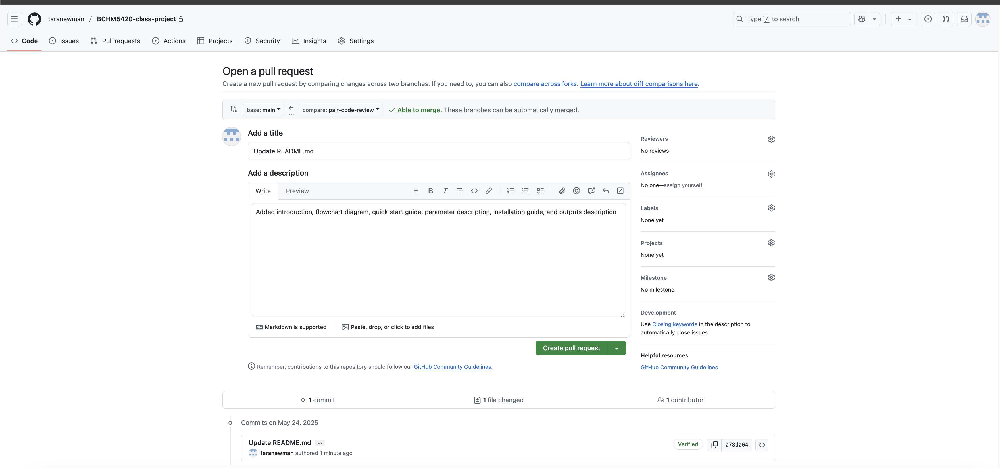

# Documentation, Troubleshooting and  Pair Code Review

2025-05-26


We will start by continuing with the last few topics from Data wrangling then continue onto Documentation, Troubleshooting, and Pair Code Review


## Table of Contents

[Introduction](#introduction)<br>
[Documenting code functions](#documenting-code-functions)<br>
[Documenting your code repository with a README](#document-your-code-repository-with-a-readme)<br>
[Issues](#issues)<br>
[Forking](#forking)<br>
[Pull requests and pair code review](#pull-requests-and-pair-code-review)<br>
[fixme-nf pipeline](#fixme-nf-pipeline)<br>
[Documenting your research/analysis with a dry lab "notebook"](#documenting-your-researchanalysis-with-a-dry-lab-notebook)<br>
[Code Review Assignment](#code-review-assignment)<br>
[Additional Resources](#additional-resources)<br>
[References](#references)<br>
[Recap](#recap)<br>


## Introduction


Documentation is defined as material that provides official information or evidence or that serves as a record. In the context of bioinformatics, we want to document our code and what it is doing. We also want to document the steps we take to perform an analysis. This allows ourselves and others to reproduce and build upon our work. 


 

Image [Credit](https://github.com/ybouz2/project-tech/wiki/Coding-standarts): Yousri Bouzaien 


Documentation is our link to the code we write and the bridge that lets others understand, use, and build upon it. Without it, your code becomes a puzzle, even to you after a few weeks away. Documentation provides transparency, reproducibility, and contributes to the betterment of our bioinformatics tools and research. Whether you're creating an open source project or just trying to remember why you wrote that one weird function, good documentation is how you keep the story straight. It's how you invite collaboration and prevent confusion.

***"Open Heart. Open Source. Open Mind."***. 

In your documentation is where you want to spill ***all*** the tea. That means share ***everything***. All the data, notes, code, and context someone would need to fully reproduce your work. Don’t spread rumours with your documentation. Give the facts, and give all of them.


Good documentation in the context of research answers the following questions:

- How is your data gathered?
- What variables did you use?
- How did you use code to clean/analyze your data?


A few (but not all) of the areas where you will want to supply good documentation is when:

1. Documenting your individual code functions and scripts.
2. Documenting your code repository with a README or a tool with an online docs source. (ie. Nextflow docs)
3. Documenting your research/analysis with a dry lab "notebook".


## Documenting code functions

Let's take a look at this function here. Is it easy for someone to tell what this function is doing when looking at this for the first time?


```python
function1 <- function(df, col1 = "Accession", start_col = "AMK", end_col = "S") {

  results <- df %>%
    select(all_of(c(col1, start_col:end_col))) %>%
    pivot_longer(
      cols = all_of(start_col:end_col),
      names_to = "Drug_phenotypic",
      values_to = "Phenotype"
    )
  
  return(results)
}

```

- What is `function1` doing? What is `df`? What is being returned in `results`?
- Only from the column names `names_to` and `values_to` do we get an idea that this function has something to do with drugs and their phenotype. 


When documenting code functions, clear and consistent documentation is key to making your code readable, reusable, and maintainable, especially for collaborators or future you.

A well-documented function should include:

- **Function Description**: A concise summary of what the function does.

- **Parameters**:

    - The names of the parameters and ***types*** (e.g., string, numeric, list)

    - A ***description*** of what each parameter represents. In this case, what is `col1`? What is `df`? 

- **Return Value**:

    - What the function returns

    - The return type (e.g., data.frame, boolean, string)

- **Side Effects** (optional):

    - Any changes to the environment or external files, if applicable
        - ie. any changes to global variables, or creating, modifying, or deleting files.

    - Assumptions and Limitations:

        - Expected input format, edge cases, or known limitations

- **Example Usage** (optional but helpful):

    - A short example showing how to call the function and interpret the output


**Bonus Tips:**

- Use inline (line) comments inside the function to break down complex steps.
    - If you are doing something non-standard or due to some underlying bug in another library, add a reference or link to support why you've done this. ie. add in a git issue reference

- Use consistent formatting. There are specific documentation styles, such as ***Roxygen2*** format in R,  ***docstrings*** in Python, or ***JSDoc*** in JavaScript.  It's best to use standard documentation practices when contributing code to an existing repository, and make sure it is consistent with the current documentation. For your own work, you can pick your style that works best for you and stick with it. Pick whatever is simplest for you and that you will do every time.

- Keep it updated when code changes.

- Use short, simple, but descriptive variable names. 


Applying these principles to our function will give something like this:


```python
# Description:
# This function reshapes phenotypic antibiotic resistance results from a wide format 
# to a tidy "long" format. Each row in the output represents one phenotypic result 
# for one drug and one sample. This format is ideal for visualization and analysis 
# using tidyverse tools like ggplot2 or dplyr.
#
# Parameters:
# amr_genotypic_phenotypic_results (data.frame): 
#   A data frame where each row represents a sample. It must include:
#     - A sample ID column (default: 'Accession') of type character.
#     - Multiple columns with phenotypic results for each drug (e.g., AMK, CAPREO, S),
#       with values like:
#         - 'S' (Sensitive)
#         - 'R' (Resistant)
#         - 'NA' (Not tested or missing; )
#
# sample_id_col (character): 
#   Name of the column containing sample IDs. Default is 'Accession'.
#
# drug_start_col (character): 
#   Name of the first drug column in the phenotypic result range (e.g., "AMK").
#
# drug_end_col (character): 
#   Name of the last drug column in the phenotypic result range (e.g., "S").
#
# Returns:
# (data.frame) A tidy data frame (tibble) with the following columns:
#   - 'Accession' (character): Sample ID.
#   - 'Drug_phenotypic' (character): Drug name (e.g., "AMK", "STR").
#   - 'Phenotype' (character): Phenotypic result ("S", "R", or "NA").
#
# Assumptions and Limitations:
# - Drug columns are assumed to be contiguous in the data frame, and range selection 
#   (from `drug_start_col` to `drug_end_col`) must be valid.
# - Phenotypic result columns must contain interpretable values ("S", "R", or "NA").
# - Missing values may be represented as NA or as the string "NA".
#
# Example Usage:
# df <- data.frame(
#   Accession = c("Sample1", "Sample2"),
#   AMK = c("R", "S"),
#   STR = c("S", "R"),
#   S   = c("NA", "S")
# )
# 
# tidy_df <- pivot_phenotypic_data(df)
# print(tidy_df)
#
# Output:
#   Accession Drug_phenotypic Phenotype
#   Sample1   AMK             R
#   Sample1   STR             S
#   Sample1   S               NA
#   Sample2   AMK             S
#   Sample2   STR             R
#   Sample2   S               S


pivot_phenotypic_data <- function(amr_genotypic_phenotypic_results, sample_id_col = "Accession", drug_start_col = "AMK", drug_end_col = "S") {

  # Select the sample ID and drug phenotype columns
  tidy_phenotypic_results <- amr_genotypic_phenotypic_results %>%
    select(all_of(c(sample_id_col, drug_start_col:drug_end_col))) %>%
    
    # Reshape from wide to long format
    pivot_longer(
      cols = all_of(drug_start_col:drug_end_col),  # Columns containing drug phenotypes
      names_to = "Drug_phenotypic",                # New column for drug names
      values_to = "Phenotype"                      # New column for phenotype values
    )
  
  return(tidy_phenotypic_results)
}
```

The amount of detail depends on the audience of the code. If it's just for you, then you can have a sense on what is important for you to know and remember. For others it's important to document all the details. You don't need it for every single function, but documenting more complex functions is good practice.

## Documenting your code repository with a README


The top level directory of your Github repository should ALWAYS have a README!

Every project will be different but in general, your README should consist of 

1. An introduction to what your repository is about
2. A diagram to illustrate the process being performed
3. A quick start guide for how to run the code
4. Parameters and their definitions
5. Installation instructions
6. A description of your outputs


 

Let's take a look at BCCDC-PHL/bioinflow and BCCDC-PHL/tbprofiler-nf to get an example:


https://github.com/BCCDC-PHL/bioinflow 

https://github.com/BCCDC-PHL/tbprofiler-nf


### 1. An introduction to what your repository is 

This section is where you will want to provide a description/introduction to your repository. It shouldn't be incredibly long but should have at least a few sentences to tell us what is going on in your repository.

A good GitHub README introduction should quickly give readers a clear understanding of what your project is, what it does, and why it matters. 

Here is what to include in the intro section of your README:

- Project name or title

- Purpose of the repository 
    - What does this pipeline/tool/workflow do?

- Context or motivation
    - Why did you build it? What problem does it solve?

- Main features or capabilities and a brief overview of key functionalities.

- Who it's for and who should use it? (ex. researchers, public health labs, bioinformaticians)

- Any other relevant information


### 2. A diagram to illustrate the process being performed

**Mermaid Diagrams**

Mermaid diagrams are a useful and simple way to make your custom  workflow diagram that you can easily code into any markdown file. Read more on the Mermaid documentation [here](https://mermaid.js.org/intro/). You can add mermaid diagrams to any markdown chunk to add your diagram. In particular, on Github to add a diagram to your README.md


This diagram shows the steps from sample to variant calling—a classic NGS pipeline:

FASTQ → BAM → VCF


```python

flowchart TD
    A[Start: Sample Collection] --> B[DNA Extraction]
    B --> C[Library Preparation]
    C --> D(Sequencing)
    D -->  E[Raw Reads]
    E -->  F[Quality Control ]
    F --> G[Read Alignment ]
    G --> H[Variant Calling]
    H--> I[End: VCF Output]

```

You can add mermaid diagrams to any markdown chunk to add your diagram. In particular, on Github to add a diagram to your README.md, you would add this around your flowchart diagram. (ie. add your diagram between the tick marks)

\```mermaid

 flowchart TD ..... <[insert flowchart here]>
   

\```


**Mermaid Syntax Cheat Sheet**

| Syntax                        | Description                          |
|------------------------------|--------------------------------------|
| `flowchart TD`               | Top-down flowchart direction         |
| `flowchart LR`               | Left-to-right flowchart              |
| `A --> B`                    | Arrow from A to B                    |
| `A -->\|label\| B`           | Arrow with label                     |
| `A[Text]`                    | Rectangle node with text label       |
| `A(Text)`                    | Rounded node with label              |


You can generate and preview your Mermaid diagrams at https://mermaid.live/


 

Let's try creating our own Mermaid Diagram. What flowchart can you come up with?

Try creating a flow chart of the steps of your morning routine or another process you're familiar with the steps of. 

### 3. A quick start guide for how to run the code

In this section, provide the simple steps for how to run your code, ie. the command/arguments the user will need to get your project up and running without getting bogged down in the details. Assume they've read this before and they are looking for a quick reminder of the basic steps they need to run. 


ie 


**Quickstart**
```
nextflow run BCCDC-PHL/tbprofiler-nf \
  --fastq_input <fastq_input_dir> \
  --outdir <output_dir>
```

Here we are providing the basic arguments for running the pipeline. There are other options for the pipeline but these are the bare bones parameters you need to run the pipeline successfully.

### 4. Parameters and their defintions

This section is where we can provide some more details on the parameters. You can think of this table as a cheatsheet of what is going on in the nextflow config. The Default value would be what the value is without adding this parameter. 

In this example. the fastq input is required as the pipeline will not execute successfully without this. The others are optional as the values are already specified in the nextflow config. 


| Flag                         | Default Value | Description                                       |Requirement |
|:-----------------------------|--------------:|:--------------------------------------------------|:------------------------------|
| `min_depth`                  |            10 | Minimum depth of coverage used to call a SNP      | Optional    |
| `min_af_used_for_calling`    |           0.1 | Minimum minor allele fraction used to call a SNP  | Optional   |
| `min_af_used_for_prediction` |           0.1 | Minimum minor allele fraction used to predict AMR | Optional   |
| `fastq_input`                |           NOFILE | Path to input directory containing fastq files | Required   |
| `outdir`                     |           ./results  | Path to where results will be output        | Optional    |


### 5. Installation instructions

Provide instructions on how someone can install any needed tools for your package. Make no assumptions here and provide all the tools needed to get your tool up and running.

For example:

- provide a link to how to install nextflow
- provide the commands for tool installation
- how to install your tool with conda or docker


### 6. A description of your outputs

Describe the directory structure of your outputs. You may want to include a description of the main outputs and the information they provide.


ex. 
```
.
└── sample-01
    ├── sample-01_TIMESTAMP_provenance.yml
    ├── sample-01_coverage_plot.png
    ├── sample-01_fastp.csv
    ├── sample-01_fastp.json
    ├── sample-01_low_coverage_regions.bed
    ├── sample-01_qualimap_alignment_qc.csv
    ├── sample-01_snpit.tsv
    ├── sample-01_snpit_unchecked.tsv
    ├── sample-01_tbprofiler.bam
    ├── sample-01_tbprofiler.bam.bai
    ├── sample-01_tbprofiler_full_report.csv
    ├── sample-01_tbprofiler_full_report.json
    ├── sample-01_tbprofiler_lineage.csv
    ├── sample-01_tbprofiler_resistance.csv
    ├── sample-01_tbprofiler_resistance_mutations.csv
    ├── sample-01_tbprofiler_summary.csv
    ├── sample-01_tbprofiler_targets.vcf
    └── sample-01_tbprofiler_whole_genome.vcf
```


| Output                        |  Description                                      
|:-----------------------------|--------------:|
| `sample-01_tbprofiler_resistance_mutations.csv`|          This file contains the resistance mutations detected by TBProfiler in your sample. The output columns are [SampleID, Gene, Mutation, Allele Fraction] | 
| `sample-01_tbprofiler_whole_genome.vcf`    | This VCF contains all variants in your sample relative to the H37Rv reference genome | 
| `sample-01_snpit.tsv` | This file contains the subspeciation lineage calls by the tool SNPIT| 
| `sample-01_tbprofiler_full_report.csv`                | The full tbprofiler output report.| 


## Issues

As we have all experienced, errors and troubleshooting come with the territory. When you begin contributing to the open source community, you will likely encounter issues with the code you are using, have ideas for improvements, or have questions about its intended use. Code repositories on GitHub will come with issue trackers, where ideas or issues for the repo can be documented. The repo you made for your individual research projects has one, too!


You may notice a couple colorful [labels](https://docs.github.com/en/issues/using-labels-and-milestones-to-track-work/managing-labels#about-labels) in the above image. These labels help to categorize pull requests and issues. For example, the `bug` label designates an issue or pull request (PR) is addressing a problem with the functioning of the code, an `enhancement` label is a suggestion for a new feature or improvement, and `good first issue` categorizes an issue as being ideal for first time contributors to resolve. You can find the full list of labels [here](https://docs.github.com/en/issues/using-labels-and-milestones-to-track-work/managing-labels#about-default-labels). 


You can open issues from multiple places including directly from the code, discussions, URL, project, or [GitHub CLI](https://docs.github.com/en/github-cli/github-cli/about-github-cli). Some repos may have templates that you can follow when opening an issue, but general rules of thumb include being descriptive, providing a minimal reproducible example, and specifying the version of tools or OS you are using - anything that may help people help you!


You can you link issues to pull requests using a [keyword](https://docs.github.com/en/issues/tracking-your-work-with-issues/using-issues/linking-a-pull-request-to-an-issue#linking-a-pull-request-to-an-issue-using-a-keyword) and issue # in the description of your PR. For example, `fixes` #22 or `closes` #22.


## Forking

"Forking" a repository is usually the first step in editing someone's code when you do not have write access (ie. are not designated a collaborator by the author). A "fork" allows you to make a copy of the code so that you can edit and safely experiment with changes so as not to affect the original codebase. If you were to `git clone` or copy someone's repo, make edits, then push those edits back into their repository you would be prevented from adding your changes. Performing the same steps on a ***fork*** of someone's repo allows you to safely add the changes and give the original author a chance to first review your edits before approving them to be added (ie. make a PR). You can think of the process of forking as editing a word document with "track changes" on instead of directly changing someone's document. Once you have *your* copy of the repo you are trying to edit on GitHub under your account, you can proceed to make a local copy of it on your computer using the `git clone` command we covered in lecture 2. Now you can edit and test the code without worrying about breaking the original!


There are different practices for naming branches, but one is to number them according to the issue # with a short description of what fixes or features the edits in that branch will achieve. For example, in the above issue tracker, the branch that we could create to resolve issue #22 (missing a dependency called `ronn`) may be named `22-add-ronn`. Next we will see how to create a pull request (where we want to merge our changes into the original repo) and request that it be reviewed. 

## Pull requests and pair code review

Remember back to class 2 where we introduced Github and went over creating branches, adding files, commiting files and pushing our changes to our branch.

When we want to merge branches together, we can create a pull request. This gives ourselves and others a chance to review the changes that we want to merge back into our main branch.


Find more information about pull requests [here](https://docs.github.com/en/pull-requests/collaborating-with-pull-requests/proposing-changes-to-your-work-with-pull-requests/creating-a-pull-request)


The following steps outline how to check out a branch to update your README, create a pull request to merge this back into your main branch, how to request a code review, and how to give a code review. 

Both website and command-line steps are provided. 


### Adding Changes and Creating a Pull Request


1. Create a new branch to store your code changes

Click on "Branches"


 


Click "New branch"


 

Give your branch a name, and click "Create new branch"


 


You can perform the equivalent steps on the command line by cloning your repo, changing into the repo directory and checking out a branch. 


```python
# command line equivalent

cd <git repo folder on command line>

git checkout -b pair-code-review
```

2. Go to your branch and edit the file 


Click on the name of your branch you just created in step 1. 

 


Click on the little pencil icon to edit your README.md. If you didn't initialize your repository, click on "Add file" (beside the green "Code" button) and create a new file called README.md


 


On the command line, you can just create a new file, or edit your README with your editor of choice. (ex. Vim, VS Code etc. )


```python
# command line equivalent

code README.md
```

3. Add documentation that we learned in class today to your README. 

Add the appropriate information about your project to your README. You can use your project proposal for a lot of this information


 


You can click the preview button to see how your README will display on your repository page. 


 

4. Commit your changes to the branch 


Click on the green "Commit changes" button and add an appropriate description of what you added to your README.

 


The command line steps would be to add the file, commit the changes and push your changes to your branch. 


```python
# Command line equivalent

git add README.md

git commit -m "Update readme with introduction, flowchart diagram, quick start, installation instructions, parameters, outputs"

git push
```


5. Create a pull request

After making changes, there should be an option that pops up that changes have been made to your branch. Click the green "Compare and pull request" button.

**Note**: This step easiest to do on the website. If working on the command line, after you push your updates to the repository, you will see a the same pop up on your repository website to create a pull request. 


 


Add a description and click "Create pull request"

 

You did it! You've now created your pull request. If you are working alone, you can review your changes and merge to your main branch by clicking on the green "merge button".

If you're working with others, the next step will be request for someone to review your changes.

### Adding a code reviewer

6. Add your pair code review partner as a collaborator to your repository so they can review your pull request

Click on Settings > Collaborators > Invite People and enter their github username

 


Find their name and click "Add to repository"


 


7. Go back to your pull request (by clicking on Pull Requests in the top bar)

You should now be able to add them as a reviewer once they accept your request

 


### Reviewing a Pull request


8. Reviewer Instructions:

Click on the pull request and click review changes.

 


Leave your review of your partner's read me.

Add one area you think they documented very well and one area where you think could use further explanation and any examples you think would be useful.

When you have finished your review, click "Submit Changes"

 


Everyone needs to send us the link to the github repositories and we will be able to mark your review. 


## fixme-nf pipeline

At this point, we have covered everything you will need to complete your code review assignment. In addition to providing feedback on the README's of two of your classmates, you will practice:

1. opening an issue
1. forking a repository
1. cloning that repository 
1. fixing an issue
1. creating a PR

from the [fixme-nf pipeline](https://github.com/uleth-advanced-bioinformatics/fixme-nf). Try running it and be sure to read the docs and error messages! Feel free to collaborate and troubleshoot together but each person must individually submit an issue, fix that issue, and make a pull request to the fixme-nf repo that resolves/ references the issue they created. 

## Documenting your research/analysis with a dry lab "notebook".

Effectively documenting your dry lab (computational/ bioinformatics) work is essential for reproducibility, collaboration, and your own future reference. Just like wet lab notes track your benchwork, a dry lab notebook should clearly explain your data, analysis steps, rationale, and outcomes.

### Tips for Documenting your work


1. Pick One Medium and Stick With It

Choose a consistent method for note-taking and project documentation. This helps keep your records organized and reduces the chances of losing track of your progress.

Common mediums include:

- RMarkdown / Jupyter Notebooks:
    - This allows you to combine code, results, and narrative text in a single, reproducible document. These are great for exploratory data analysis, visualization, and small projects.
    - The downside is that these are language-specific (although you can mix R and Python code) and harder to scale across multiple tools or pipelines.
- Note-taking apps (e.x., OneNote, Notion, Obsidian):
    - Flexible and easy to use for daily notes, troubleshooting logs, or progress updates
    - Once consideration is the sensitivity of the information you are recording. Ensure that sensitive data is not put on platforms where data is stored externally.
    - These often aren't as nice for tracking code compared to markdown formats. 


Regardless of the platform, keep things searchable, dated, and version-controlled. 


2. Include sufficient documentation 

You don't have to write down every detail, but try to document any errors you encountered, and how you solved them.

- Keep track of file paths and the directories where you performed your analyses. 
- Keep track of the conda environments and tools used in your analysses
- Keep track of result findings
- Keep track of where input and output data is stored.
- Keep track of what scripts you made and how they were used in your analysis and where they are stored. 


###  Standard Operating Procedures


Similar to a wet lab environment, it's important to create standard operating procedures for bioinformatics workflows. This is something that is easy to forget but is an important aspect of reproducibility. Once you have a process set up, document all the steps to reproduce the analysis. These are efficient to create in a markdown format where you can include both a text description and include the code that should be run.

Once you have done the work to create a solid reproducible workflow, document it and the steps so others can perform the analysis as well. 

Keep a revision history to track any changes made to the SOP. 

See below an example SOP


**SARS-CoV-2 Lineage Assignment SOP**

### Overview
This workflow assigns PANGO lineages to consensus genomes using Pangolin.

### Requirements
- pangolin v4.2
- conda environment: `pangolin_env.yml`
- Input: Multi-FASTA file of consensus genomes

### Steps
1. Activate environment  


```python

conda activate pangolin_env
```

2. Run lineage assignment script


```python
pangolin consensus_sequences.fasta --outfile lineage_report.csv
```

3. Review results
Output CSV will contain lineage calls and QC flags.

Notes
- Ensure sequences are >90% complete.
- If you see 'lineage_not_reported', check for low-quality input or failed preprocessing.


### Revision Hstory

| Date       | Version | Author        | Description of Update                                      |
|------------|---------|---------------|-------------------------------------------------------------|
| 2024-05-25 | v1.0    | [Your Name]   | Initial draft created with documentation structure.         |
| 2024-05-28 | v1.1    | [Your Name]   | Changed conda environment name   |
| 2024-06-01 | v1.2    | [Your Name]   | Changed script output parameters   |


## Code Review Assignment


You will have until end of class on Wednesday to complete the code review for the project README's of your two assigned classmates and resolve at least one issue with a PR to the [buggy Nextflow pipeline](https://github.com/uleth-advanced-bioinformatics/fixme-nf).

For Wednesday's class, please have RStudio installed. Follow these instructions: https://posit.co/download/rstudio-desktop/ 

## Additional Resources 

- [Top considerations for creating
bioinformatics software documentation ](https://academic.oup.com/bib/article/19/4/693/2907814)
- [Code Documentation Best Practices and Standards: A Complete Guide](https://blog.codacy.com/code-documentation)

## References

- Documentation ideas adapted from [UC Berkeley Library](https://guides.lib.berkeley.edu/how-to-write-good-documentation)

## Recap

You should now have some basic tools for  ***documenting*** your code, scripts and github repositories. You should be comfortable creating an ***issue***, ***fork***, ***pull request***, and know how to add a ***review*** to someone else's code. You should now have some tips for creating a ***dry lab notebook*** to store your computational results. 
