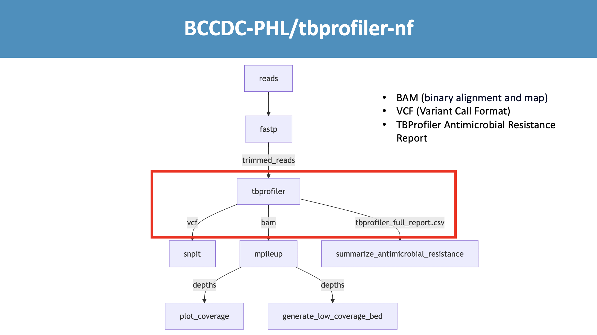
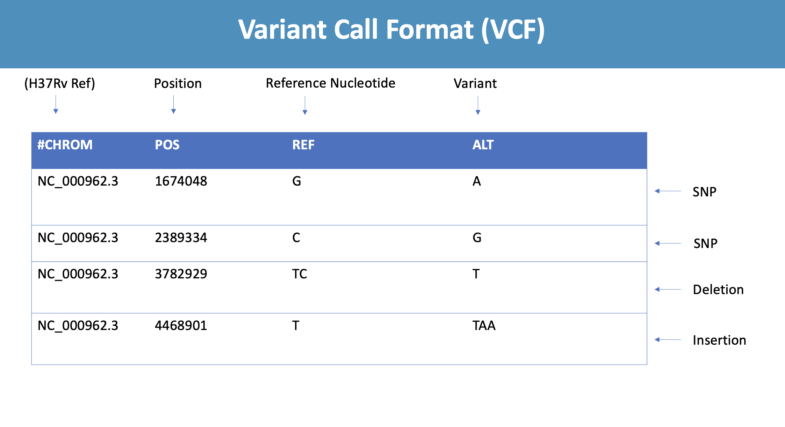

# TBProfiler - Applied Bioinformatics in Antimicrobial Resistance 

2025-06-02


## Table of Contents

[Introduction](#introduction)<br>
[Phenotypic Data](#phenotypic-data)<br>
[Genotypic Data](#genotypic-data)<br>
[WHO Database](#who-database)<br>
[Data Generation](#data-generation)<br>
[Inner workings of BCCDC-PHL/tbprofiler-nf](#inner-workings-of-bccdc-phltbprofiler-nf)<br>
[Results](#results)<br>
[Results Interpretation](#results-interpretation)<br>
[Limitations and Considerations](#limitations-and-considerations)<br>
[Conclusions](#conclusions)<br>
[Recap](#recap)<br>
[Additional Learning](#additional-learning)<br>
[References](#references)<br>

## Introduction

In Class 5, we worked through tidying a messy *Mycobacterium tuberculosis* (MTB) antimicrobial resistance (AMR) dataset containing both ***phenotypic drug susceptibility testing*** (pDST) data and drug resistance mechanisms output from TBProfiler. Today, we will dive deeper into how this data was generated, how TBProfiler's peformance can be compared (validated) against the phenotypic data, what conclusions we may be able to draw from it, and some important considerations and limitations that come along with this type of analysis.

## Phenotypic Data

MTB is typically cultured on Lowenstein-Jensen (solid) medium or in Mycobacterium Growtih Indicator Tube (MGIT) (liquid) cultures. pDST involves adding an antibiotic to the medium and assessing whether the bacteria can grow in its presence (indicating resistance) or not (indicating sensitivity). 

Some limitations of this approach include:
- **Determining the minimum inhibitory concentration (MIC)**: What drug concentration should be used to test for phenotypic susceptibility? What if the strain appears resistant at low concentrations but susceptible at higher ones? What concentration range should be tested?
- **Subjectivity**: Classifying a strain as resistant, sensitive, or intermediate can be subjective and dependent on the lab technician's judgment, introducing the potential for human error.
- **Time**: Culture-based methods can take several weeks, potentially delaying appropriate treatment for patients.
- **Heteroresistance Detection**: pDST may fail to detect heteroresistance (i.e., mixed populations of susceptible and resistant bacteria in the same sample)

## Genotypic Data

Whole genome sequencing (WGS) can be used to detect mutations associated with antimicrobial resistance in MTB. This approach offers a faster alternative to pDST and deeper insights into the genetic mechanisms of resistance. Once the genome is sequenced, bioinformatics tools can screen samples for known resistance-associated mutations across the entire genome. The tool we will be focusing on today is [TBProfiler](https://github.com/jodyphelan/TBProfiler). TBProfiler uses ***reference based assembly***, which aligns sequencing reads to the MTB reference genome H37Rv, and then calls variants (genome changes in the sample compared to the reference). These variants are then compared to its drug-resistance database to detect for the presence of any known resistance mechanisms. TBProfiler provides the number of reads supporting drug resistance variants, also known as the allele fraction, which provides insights into hetero-resistance ([TBProfiler](https://github.com/jodyphelan/TBProfiler))

Common Resistance-Associated Mutations:
- rpoB: associated with rifampicin resistance
- katG and inhA: associated with isoniazid resistance
- embB: associated with ethambutol resistance


[The World Health Organization Catalogue of mutations in Mycobacterium tuberculosis complex and their association with drug resistance](https://www.who.int/publications/i/item/9789240082410) catalogues over 30,000 MTB variants for 13 anti-TB medicines and provides performance metrics and a final confidence grading to aid in result interpretation. TBProfiler includes this information in it's drug resistance database. 

For applications to other pathogens, [The Comprehensive Antibiotic Resistance Database](https://card.mcmaster.ca/) (CARD), as the name implies, is an excellent resource categorizing resistance genes, their products and associated phenotypes for over 400 pathogens.

Advantages of Genotypic Testing:
- **Speed**: Resistance profiles can be generated within days, compared to the weeks required for pDST.
- **Automation**: Reduces subjectivity and human interpretation errors.
- **Comprehensive analysis**: All known resistance mechanisms to multiple drugs can be assessed in a single analysis.
- **Heteroresistance detection**: Sequencing provides a higher resolution to detect heteroresistant populations.

Limitations of Genotypic Testing:
- **Dependence on known mutations**: Only resistance mechanisms that have already been characterized in the database can be detected. Novel or rare mutations may be missed.
- **Uncertain clinical impact**: Some mutations may not confer phenotypic resistance, or may result in low-level resistance with unclear clinical significance.
- **Ambiguity of minor allele fractions**: It can be difficult to distinguish sequencing errors from variants present at low allele fractions (ie., 6 reads present with the variant vs. 60 reads present with the reference allele).


## Data Generation


Let's walk through how we can obtain the data for this sample from our tidy dataset.


|Accession  |Drug                            |Phenotype |Gene |Mutation    |Allele_Fraction |
|:----------|:-------------------------------|:---------|:----|:-----------|:---------------|
|ERR1036286 |Amikacin                        |S         |NA   |NA          |NA              |
|ERR1036286 |Capreomycin                     |S         |NA   |NA          |NA              |
|ERR1036286 |Ethambutol                      |R         |embB |p.Met306Val |1               |
|ERR1036286 |Ethionamide                     |R         |ethA |c.180delC   |0.99            |
|ERR1036286 |Isoniazid                       |R         |katG |p.Ser315Thr |1               |
|ERR1036286 |Ofloxacin                       |S         |NA   |NA          |NA              |
|ERR1036286 |Para-aminosalicylic acid        |NA        |thyX |c.-16C>T    |1               |
|ERR1036286 |Pyrazinamide                    |R         |pncA |p.Asp63Ala  |1               |
|ERR1036286 |Rifampicin                      |R         |rpoB |p.Ser450Leu |1               |
|ERR1036286 |Streptomycin                    |R         |rpsL |p.Lys43Arg  |1               |


ERR1036286 is a sample accession from the SRA. 

Let's use the SRA explorer to obtain the raw fastq files: https://sra-explorer.info/# 


[SRA Explorer](https://github.com/ewels/sra-explorer), created by Phil Ewels is a useful site to search for the data in the SRA, particularly in the case where you're just looking for a quick few samples. 


If you're searching for samples more frequently, or looking for a high number of samples, there are a number of other command line alternatives:

- [enaBrowserTools](https://github.com/enasequence/enaBrowserTools) as mentioned in class 5 for fetching metadata
- [nf-core/fetchngs](https://nf-co.re/fetchngs)
- [pysradb](https://github.com/saketkc/pysradb)
- [fetchfastq](https://github.com/pachterlab/ffq)


In our case, SRA Explorer will do nicely. 

Search for the accession, and select the sample and click "Add to collection" 


<br>

Click on "1 saved dataset" in the top right corner to obtain the script for downloading.


<br>

Now open up your terminal to download the fastq files.


```python
# make a directory to store your fastq input and cd into that directory
mkdir -p class8/demo/input
cd class8/demo/input

# download the fastqs
curl -L ftp://ftp.sra.ebi.ac.uk/vol1/fastq/ERR103/006/ERR1036286/ERR1036286_1.fastq.gz -o ERR1036286_Illumina_MiSeq_paired_end_sequencing_1.fastq.gz
curl -L ftp://ftp.sra.ebi.ac.uk/vol1/fastq/ERR103/006/ERR1036286/ERR1036286_2.fastq.gz -o ERR1036286_Illumina_MiSeq_paired_end_sequencing_2.fastq.gz
```

Now that we have our input data, we can now run our data through TBProfiler to get the genotypic resistance data. There are two options for running TBProfiler. The first option is through the command line and the second option is through their webserver.

### Command Line Options

You can either run the TBProfiler directly [https://github.com/jodyphelan/TBProfiler] or with a handy Nextflow wrapper, such as [BCCDC-PHL/tbprofiler-nf](https://github.com/BCCDC-PHL/tbprofiler-nf). 

This would be the command to run BCCDC-PHL/tbprofiler-bf on our fastq input: 


```python
nextflow run BCCDC-PHL/tbprofiler-nf --fastq_input class8/demo/input --outdir demo_output -profile conda --cache conda_env
```

<br>


If you have only one or two samples to analyze, TBProfiler also has a webserver for analysis on their [website](https://tbdr.lshtm.ac.uk/). We will be running through here today for ease of use and avoid any environment set up issues.

If you are unable to successfully run tbprofiler


Step 1: Go to their webserver site and upload the fastq data. This will take a few minutes to upload. In the mean time we will now take a break to do our reading assignments for today!

https://tbdr.lshtm.ac.uk/upload

<br>


Step 2: Once it is uploaded, click submit.


You will then see a page that looks something like this 


<br>

Step 3: You can click the "run" and watch the process with the "Toggle log"

<br>


If you have errors uploading or running the data, you can search for this RunID on the website (Step 2 on the Home page): `ea3a71e7-6fc5-438e-a052-ef498bdb9df8`

<br>

## Inner workings of BCCDC-PHL/tbprofiler-nf 

Now we will take a deeper dive into what is going on behind the scenes of this pipeline: 


### Fastp

<br>

We start with our fastq reads as input, which are first processed through fastp. Fastp is a tool for quality control and preprocessing of sequencing reads. It removes adaptors, cuts low-quality bases at the 5' or 3' ends, and filters out any reads that are too short or fail quality thresholds. This step ensures that we are working with clean, high-quality reads.

Next, the trimmed reads are passed to TBProfiler. 


### TBProfiler
<br>


As we discussed earlier, TBProfiler aligns reads to the TB reference genome, using a mapping tool called BWA (BCCDC-PHL/tbprofiler-nf default) and then calls variants using bcftools. 

These variants are then compared to a drug-resistance database to detect isolates with potential antimicrobial resistance mechanisms. 

The main output files produced by tbprofiler that we use in our pipeline are:

- A BAM file , which is a file showing the alignment of the reads to the reference,
- A Variant Call Format File (referred to as a  VCF) for variant analysis
- And a report of predicted antimicrobial resistance within the sample being analyzed


<br>


The alignment of the reads to the H37Rv reference is stored within the BAM file. This figure visualizes of the first step of mapping the sequencing  reads (which are the represented by the blue rectangles) to the reference genome shown in green.


From this we can identify any variations in the sample relative to the reference, such as SNPs and indels

For example, in red, we can see some of the reads differ from the reference genome at this position. 


<br>

A vcf file is then produced from this alignment. This table is a simplification of the real VCF file but highlights some columns of note, such as the name of the reference sequence, the position relative to the reference genome, the base present in the reference genome at that position, and the variant present in your sample.

The variant can be a single base variant called a SNP as shown in the first two rows, but it can also represent deletions - as shown in the third row with the deletion of the C base, or an insertion like shown in the fourth row with the addition of the two A bases.


<br>

TBProfiler compares the variants present in your sample to it’s drug-resistance database to detect isolates with potential antimicrobial resistance mechanisms. 

Their database was developed using a catalog of mutations published by the WHO, which details the association between specific mutations and drug resistance.


<br>


<br>

If a variant in your VCF matches one listed in the database, that information is output in the final tbprofiler report.

In this example, our sample contains a mutation identified in the database as being associated with isoniazid resistance.


<br>

TBProfiler outputs a detailed report that we further parse into a simpler csv file  that contains the sample ID, drug, and it’s conferring resistance mutation. 

Following from the previous example, this report shows this sample contains a mutation associated with isoniazid resistance and no mutations associated with the other antibiotics

### Downstream analysis

<br>

Coming back to our pipeline workflow, the tbprofiler VCF and BAM outputs are used for subsequent downstream analyses


The VCF is used as input by SNP-it, which performs a subspeciation analysis. This works similarly to the amr detection by looking at a database of SNPs associated with different MTB subspecies.

We use samtools mpileup on the BAM file, which gives us depth information across the genome.

The depth information from the mpileup is utilized to generate coverage plots to visualize sequencing coverage across the genome and to create a  low-coverage BED file, which we use to produce gene level summary metrics to highlight genomic regions with insufficient coverage for reliable analysis. 


<br>

Mpileup is essentially looking at the pileup of the reads at a specific position , so this how we can get the depth of coverage at each base position. 


<br>


For each sample, we also produce a detailed provenance report for tracking of the exact tool versions and commands used to produce the results ***reproducibility***.

If discrepancies arise in the results, provenance information makes it easier to identify and resolve errors, whether they stem from software changes, data corruption, or human mistakes. This is also important when sharing data and results with collaborators or submitting to public repositories, as provenance tracking ensures others can replicate your analysis and understand the methods used. As well, if samples need to be re-analyzed at any point in the future, this ensures the  same methods and tools are used. 


## Results


Let's take a closer look at the tbprofiler result outputs.

We will walk through the website results and take a look at the nextflow pipeline outputs. 

Let's take a look at a sample with varying allele fractions. Enter this runid: `088dcec5-9d00-40a2-8464-59642fcc4a8b` on https://tbdr.lshtm.ac.uk/  (Step 2).


## Results Interpretation

Now we have an deeper understanding of how we acquired our tidy dataset. Now what?


|Accession  |Drug                            |Phenotype |Gene |Mutation    |Allele_Fraction |
|:----------|:-------------------------------|:---------|:----|:-----------|:---------------|
|ERR1036286 |Amikacin                        |S         |NA   |NA          |NA              |
|ERR1036286 |Capreomycin                     |S         |NA   |NA          |NA              |
|ERR1036286 |Ethambutol                      |R         |embB |p.Met306Val |1               |
|ERR1036286 |Ethionamide                     |R         |ethA |c.180delC   |0.99            |
|ERR1036286 |Isoniazid                       |R         |katG |p.Ser315Thr |1               |
|ERR1036286 |Ofloxacin                       |S         |NA   |NA          |NA              |
|ERR1036286 |Para-aminosalicylic acid        |NA        |thyX |c.-16C>T    |1               |
|ERR1036286 |Pyrazinamide                    |R         |pncA |p.Asp63Ala  |1               |
|ERR1036286 |Rifampicin                      |R         |rpoB |p.Ser450Leu |1               |
|ERR1036286 |Streptomycin                    |R         |rpsL |p.Lys43Arg  |1               |


We will want to catagorize our results whether they are:

- a ***true positive***: ie. the sample has a resisitant phenotypic result and has an identified resistance mechanism 
- a ***true negative*** ie. the sample has a sensitive phenotypic result and has **no** identified resistance mechanism
- a ***false positive*** ie. the sample has a sensitive phenotypic result but has an identified resistance mechanism
- a ***false negative*** ie. the sample has a resisitant phenotypic result but has **no** identified resistance mechanism 

<br>


Once we have this data, we can now calculate how well TBProfiler performed for predicting antimicrobial resistance compared to the phenotypic data. 


### Comparison metrics

| Metric         | Formula                                | Interpretation in Genotypic vs Phenotypic AMR Context                              |
|----------------|----------------------------------------|-------------------------------------------------------------------------------------|
| Sensitivity    | TP / (TP + FN)                         | Among phenotypically resistant isolates, the proportion correctly predicted resistant by TBProfiler (genotypically resistant) |
| Specificity    | TN / (TN + FP)                         | Among phenotypically susceptible isolates, the proportion correctly predicted susceptible by TBProfiler (genotypically susceptible) |
| PPV (Precision)| TP / (TP + FP)                         | Of all isolates predicted resistant by TBProfiler, the proportion that are truly phenotypically resistant |
| NPV            | TN / (TN + FN)                         | Of all isolates predicted susceptible by TBProfiler, the proportion that are truly phenotypically susceptible |
| Accuracy       | (TP + TN) / (TP + TN + FP + FN)        | Overall correctness of TBProfiler's genotypic predictions compared to phenotypic results |

### Analysis


Let's run an R script to summarize the data and calculate the performance. The script is located under BCHM5420A-summer-2025/resources/class8_tbprofiler_amr.R and builds upon BCHM5420A-summer-2025/resources/class5_tidyR_data_cleaning_amr.R 

We end up with these performance metrics:


|Drug                     | TP| FP| FN| TN|Sensitivity        |Specificity          |PPV                  |NPV                |Accuracy             |
|:------------------------|--:|--:|--:|--:|:------------------|:--------------------|:--------------------|:------------------|:--------------------|
|Amikacin                 |  4|  0|  0|  9|100% (39.8%, 100%) |100% (66.4%, 100%)   |100% (39.8%, 100%)   |100% (66.4%, 100%) |100% (75.3%, 100%)   |
|Capreomycin              |  4|  0|  0|  9|100% (39.8%, 100%) |100% (66.4%, 100%)   |100% (39.8%, 100%)   |100% (66.4%, 100%) |100% (75.3%, 100%)   |
|Ethambutol               |  4|  2|  0|  0|100% (39.8%, 100%) |0% (0%, 84.2%)       |66.7% (22.3%, 95.7%) |NA                 |66.7% (22.3%, 95.7%) |
|Ethionamide              |  9|  0|  1|  3|90% (55.5%, 99.7%) |100% (29.2%, 100%)   |100% (66.4%, 100%)   |75% (19.4%, 99.4%) |92.3% (64%, 99.8%)   |
|Isoniazid                |  6|  0|  0|  0|100% (54.1%, 100%) |NA                   |100% (54.1%, 100%)   |NA                 |100% (54.1%, 100%)   |
|Kanamycin                |  5|  1|  0|  5|100% (47.8%, 100%) |83.3% (35.9%, 99.6%) |83.3% (35.9%, 99.6%) |100% (47.8%, 100%) |90.9% (58.7%, 99.8%) |
|Ofloxacin                |  6|  0|  0|  7|100% (54.1%, 100%) |100% (59%, 100%)     |100% (54.1%, 100%)   |100% (59%, 100%)   |100% (75.3%, 100%)   |
|Para-aminosalicylic acid |  0|  0|  0| 10|NA                 |100% (69.2%, 100%)   |NA                   |100% (69.2%, 100%) |100% (69.2%, 100%)   |
|Pyrazinamide             |  4|  0|  1|  1|80% (28.4%, 99.5%) |100% (2.5%, 100%)    |100% (39.8%, 100%)   |50% (1.3%, 98.7%)  |83.3% (35.9%, 99.6%) |
|Rifampicin               |  6|  0|  0|  0|100% (54.1%, 100%) |NA                   |100% (54.1%, 100%)   |NA                 |100% (54.1%, 100%)   |
|Streptomycin             |  5|  1|  0|  0|100% (47.8%, 100%) |0% (0%, 97.5%)       |83.3% (35.9%, 99.6%) |NA                 |83.3% (35.9%, 99.6%) |


What do these results tell us?

- Which drug performed the best?
- Which drug performed the worst?
- What impact does sample size have on our results?


## Limitations and Caveats

Now that we have our results, there are a number of limitations and caveats to acknowledge. 

- **Sample size**: Our analysis we performed in class only had 13 samples, which is too small to make any meaningful conclusions from. It's important to consider your statistical power when interpreting your data. It's also important that your samples size has enough resistant samples compared to suscpetible samples so that your data isn't skewed. This can be difficult when resistant samples are infrequent. 
- **When multiple resistance mechanisms are detected**:  The WHO has data on the positive predicitive value (PPV) of a mutation conditional on the mutation being SOLO, but how do we interpret the results when multiple resistance mechanisms are present for a particular drug? Does the resistance compound? Could it cancel out? Is one mutation more likely than the other at attributing resistance? 
- **When mutations have low PPVs or uncertain significance**: How do we reliably interpret our results when 75% of the time the presence of the mutation correlates with resistance, but 25% of the time it does not? What are the clinical impacts of this and how do we weigh this into our decision making? 
- **Translating results across populations**: How generalizable are the results from one dataset to another? Are results specific to a population? Resistance patterns may vary between geographic regions which can have an impact on result outputs.


## Conclusions

- The reliability of comparing TBProfiler to the phenotypic results is influenced by which antibiotics are included, the sample size, and local strain diversity and resistance patterns.
- The absence of a resistance mechanism does not guarantee susceptibility. Resistance may occur via unknown or uncharacterized mechanisms that are not present in the TBProfiler database, or coverage of resistance variants may be missing.
- Discordant results require clinical and laboratory review. Any discrepancies between genotypic and phenotypic resistance should prompt detailed review by both microbiology lab and clinical teams to ensure appropriate patient management.
- TBProfiler was validated as a predictive assay, but ongoing evaluation is necessary as resistance mechanisms and strain diversity are evolving. Continuous validation is needed to maintain its accuracy and relevance.


## Recap
You should now have a better understanding of the application of bioinformatics to ***antimicrobial resistance*** in ***Mycobacterium tuberculosis***. You have learned about ***phenotypic*** vs. ***genotypic*** data sources, how to analyze samples with ***TBProfiler*** to predict resistance mechanisms from whole genome sequencing (WGS) data using the ***WHO catalogue of mutations***, how to measure the ***performance*** of TBProfiler, and a few important limitations of this analysis.


## Additional Learning

- [Antimicrobial Databases and Genotype Prediction: Data Sharing and Analysis](https://www.futurelearn.com/courses/antimicrobial-databases-and-genotype-prediction-data-sharing-and-analysis)
- [Infectious Disease Genomic Epidemiology 2024 | 7: Antimicrobial Resistant Gene (AMR) Analysis](https://www.youtube.com/watch?v=Z4gAAYRExSg&list=PL3izGL6oi0S_e5T8qx-74WRaMR5K5U8V5&index=8)


## References

- Newman T, Jorgensen D, Hird T et al. BCCDC public health lab Mycobacterium tuberculosis complex antimicrobial resistance gene detection validation using TBProfiler. F1000Research 2024, 13:1501 (poster) (https://doi.org/10.7490/f1000research.1119985.1)
- Phelan, J., O’Sullivan, D.M., Machado, D. et al. Integrating informatics tools and portable sequencing technology for rapid detection of resistance to anti-tuberculous drugs. Genome Med 11, 41 (2019). https://doi.org/10.1186/s13073-019-0650-x
- World Health Organization. Catalogue of mutations in Mycobacterium tuberculosis complex and their association with drug resistance. World Health Organization, 2023.
